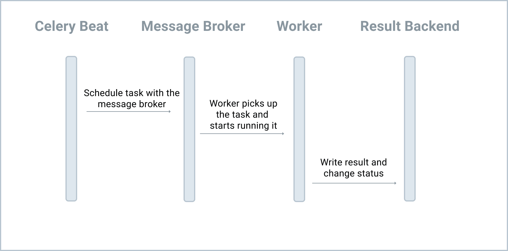

# Celery Beat

Celery Beat is a scheduling tool used to enqueue tasks at regular intervals, which are then executed by Celery workers.

Responsibilities:

1. Celery Workers are responsible for picking up tasks from the queue, running them, and returning the results.
2. Celery Beat is responsible for sending tasks to the queue based on the defined config.



In production, while you can have multiple workers processing tasks from the queue, you should only have a single Celery Beat process. More than one Celery Beat process will result in duplicate tasks being enqueued. In other words, if you schedule a single task and have two Beat processes, two tasks will be enqueued

```
    CELERY_BEAT_SCHEDULE: dict = {
        "task-schedule-work": {
            "task": "task_schedule_work",
            "schedule": 5.0,  # five seconds
        },
    }
```

The schedule field supports crontab, timedelta, and solar formats.

| Crontab Expression | Description |
|--------------------|-------------|
| `crontab()` | Execute every minute. |
| `crontab(minute=0, hour=0)` | Execute daily at midnight. |
| `crontab(minute=0, hour='*/3')` | Execute every three hours: midnight, 3am, 6am, 9am, noon, 3pm, 6pm, 9pm. |
| `crontab(minute=0, hour='0,3,6,9,12,15,18,21')` | Same as previous. |
| `crontab(minute='*/15')` | Execute every 15 minutes. |
| `crontab(day_of_week='sunday')` | Execute every minute (!) on Sundays. |
| `crontab(minute='*', hour='*', day_of_week='sun')` | Same as previous. |
| `crontab(minute='*/10', hour='3,17,22', day_of_week='thu,fri')` | Execute every 10 minutes, but only between 3–4am, 5–6pm, and 10–11pm on Thursdays or Fridays. |
| `crontab(minute=0, hour='*/2,*/3')` | Execute every even hour and every hour divisible by 3. Skips: 1am, 5am, 7am, 11am, 1pm, 5pm, 7pm, 11pm. |
| `crontab(minute=0, hour='*/5')` | Execute every hour divisible by 5 (e.g., 15:00/3pm, but **not** 5pm). |
| `crontab(minute=0, hour='*/3,8-17')` | Execute every hour divisible by 3 and

 every hour during office hours (8am–5pm). |

 bring down the existing containers and volumes, and then build the new images and spin up the containers again:

 ```
 docker compose down -v
docker compose up -d --build
```
