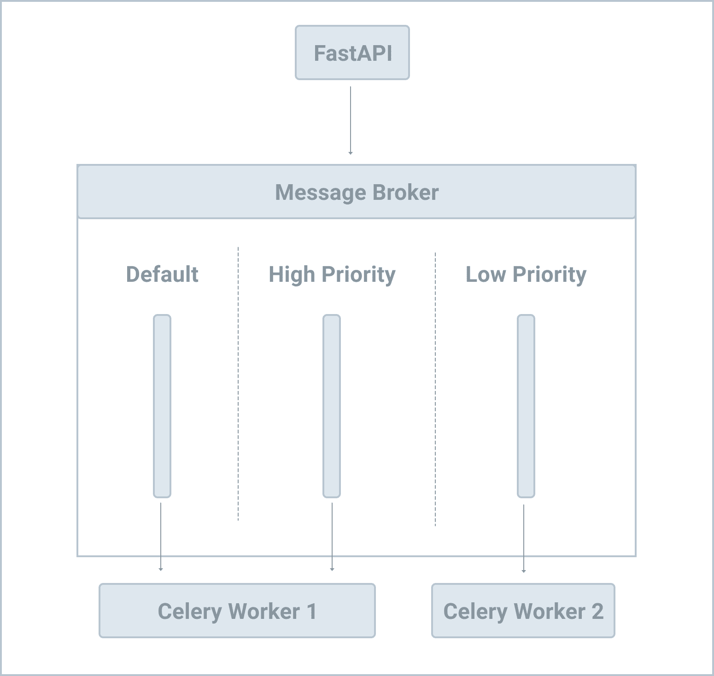

# Multiple Queues and Task Routing

## Objectives

1. Explain how you can route tasks to a specific queue to be processed by a specific worker
2. Control which workers process which tasks
3. Route tasks to specific queues based on priority
4. Dynamically configure task routing rules

## Background

By default, Celery creates a default queue in your message broker when it's first executed

Celery then routes all tasks to that default queue and all Celery workers consume tasks from that queue as well.

Celery allows you to spin up additional queues so you can have more control over which workers process which tasks.

or example, you could configure two queues: high_priority and low_priority

As the names suggest, "higher" priority tasks could be routed to the high_priority queue while the low_priority queue handles "lower" priority tasks. You can then spin up two workers: one for the high_priority queue and one for the low_priority and default queues.



It's a good practice to configure at least one additional queue (two total) so you can route slow tasks to one queue and fast tasks to a different queue so that slow tasks don't block the fast tasks.

Configuration

```py
import os
import pathlib
from functools import lru_cache

from kombu import Queue


class BaseConfig:
    BASE_DIR: pathlib.Path = pathlib.Path(__file__).parent.parent

    DATABASE_URL: str = os.environ.get("DATABASE_URL", f"sqlite:///{BASE_DIR}/db.sqlite3")
    DATABASE_CONNECT_DICT: dict = {}

    CELERY_BROKER_URL: str = os.environ.get("CELERY_BROKER_URL", "redis://127.0.0.1:6379/0")
    CELERY_RESULT_BACKEND: str = os.environ.get("CELERY_RESULT_BACKEND", "redis://127.0.0.1:6379/0")

    WS_MESSAGE_QUEUE: str = os.environ.get("WS_MESSAGE_QUEUE", "redis://127.0.0.1:6379/0")

    CELERY_BEAT_SCHEDULE: dict = {
        # "task-schedule-work": {
        #     "task": "task_schedule_work",
        #     "schedule": 5.0,  # five seconds
        # },
    }

    CELERY_TASK_DEFAULT_QUEUE = 'default'

    # Force all queues to be explicitly listed in `CELERY_TASK_QUEUES` to help prevent typos
    CELERY_TASK_CREATE_MISSING_QUEUES = False

    CELERY_TASK_QUEUES = (
        # need to define default queue here or exception would be raised
        Queue('default'),

        Queue('high_priority'),
        Queue('low_priority'),
    )


class DevelopmentConfig(BaseConfig):
    pass


class ProductionConfig(BaseConfig):
    pass


class TestingConfig(BaseConfig):
    pass


@lru_cache()
def get_settings():
    config_cls_dict = {
        "development": DevelopmentConfig,
        "production": ProductionConfig,
        "testing": TestingConfig
    }

    config_name = os.environ.get("FASTAPI_CONFIG", "development")
    config_cls = config_cls_dict[config_name]
    return config_cls()


settings = get_settings()
```

1. The Celery default queue name is celery. Here, we used CELERY_TASK_DEFAULT_QUEUE to change the name to default to prevent confusion.
2. CELERY_TASK_CREATE_MISSING_QUEUES: bool = False prevents Celery from auto-creating queues for us that we don't have defined in CELERY_TASK_QUEUES. This forces us to be more explicit by adding all the queues that we want created (even the default queue) to CELERY_TASK_QUEUES. You'll see an example of this shortly.
3. In CELERY_TASK_QUEUES, we added the default queue along with two new queues: high_priority and low_priority.

> Kombu is a messaging library that Celery leverages


```
#!/bin/bash

set -o errexit
set -o nounset

# celery -A main.celery worker --loglevel=info

watchfiles \
  --filter python \
  'celery -A main.celery worker --loglevel=info -Q high_priority,default'        # update

```
Here, we added the -Q option to the command to specify the queues enabled (high_priority and default) for the worker.

`docker compose down -v` is used to stop and remove all the containers, networks, and volumes created by docker-compose.