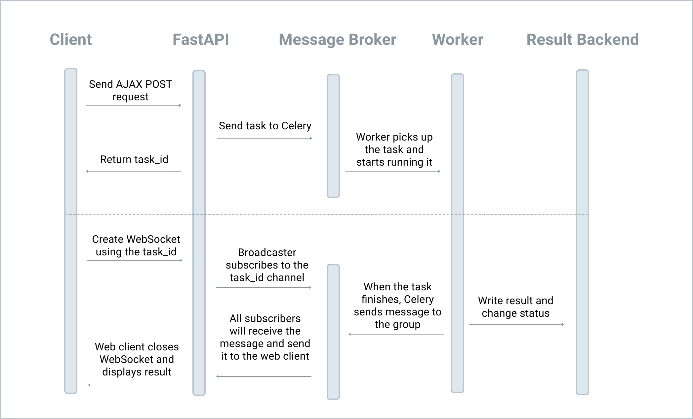

# WebSockets and Celery

we used XHR short polling to check the task status.

Short polling can be wasteful since it creates a lot of connections and queries. Plus, depending on the polling interval, there could be a delay between the task completing and the client updating.

## Objectives

1. Use Broadcaster to handle multi-process notification via Redis pub/sub
2. Explain what asyncio is
3. Convert async to sync with asgiref

## WebSocket

WebSocket is a computer communications protocol, providing full-duplex communication channels over a single TCP connection.

When a web client establishes a WebSocket connection with a server, the connection stays alive and the client and server can send messages to each other.

WebSocket is fully supported by all modern browsers:

### ASGI vs WSGI

>

    ASGI is a spiritual successor to WSGI, the long-standing Python standard for compatibility between web servers, frameworks, and applications.

In short, ASGI was created to add support for WebSockets, HTTP/2, and async/await, none of which are supported by WSGI.

FastAPI is based on Starlette and already implements the ASGI specification.



1. The client sends an AJAX request to a FastAPI view to trigger a Celery task.
2. FastAPI returns a task_id which can be used to receive messages about the task.
3. The client then uses the task_id to create a WebSocket connection via ws://127.0.0.1:8010/ws/task_status/{task_id}.
4. When the FastAPI view receives the WebSocket request, it subscribes to task_id channel.
5. After the Celery task finishes processing, Celery sends a message to the channel, and all clients subscribed to the channel will receive the message as well.
6. The client closes the WebSocket and displays the result on the page

WS_MESSAGE_QUEUE will be used for multi-process communication by FastAPI and the Celery Worker.

### Broadcaster

```
asgiref==3.7.2
asyncio-redis==0.16.0
broadcaster==0.2.0
```

asyncio_redis is a Redis client that supports asyncio, which Broadcaster requires.

Notes:

1. We created a new instance of Broadcast, which will be only used by FastAPI, not the Celery worker.
2. In the lifespan function, we established the connection before the application starts up and then disconnected from it when the application shuts down.

### Router

Notes:

1. We used @ws_router.websocket("/ws/task_status/{task_id}") to declare a Websocket path. {task_id} is a path parameter.
2. In ws_task_status, we first accepted the connection, and then obtained the task ID. After that, we subscribed to the specific channel and sent the message to the browser if it exists.
3. update_celery_task_status should be called in the Celery worker after the task is finished.
4. The Celery worker will publish the task info to the channel through Redi

Celery Signal Handler

```py
@task_postrun.connect
def task_postrun_handler(task_id, **kwargs):
    from project.ws.views import update_celery_task_status
    async_to_sync(update_celery_task_status)(task_id)
```

Note

1. Here, we created a Celery signal handler that will be called after each Celery task is executed, which sends a message to the relevant channel via update_celery_task_status.
2. We used async_to_sync to call update_celery_task_status (an asynchronous view) since, again, Celery does not work well with asyncio.
