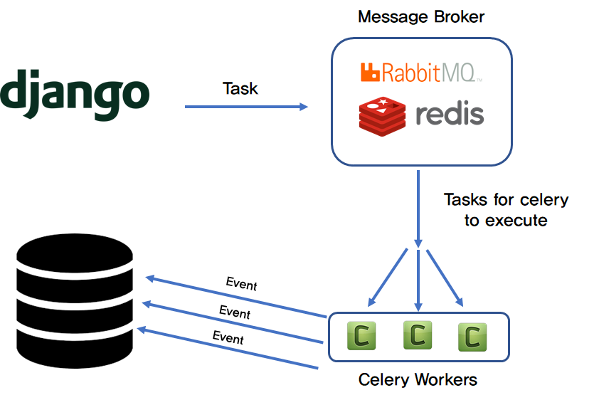
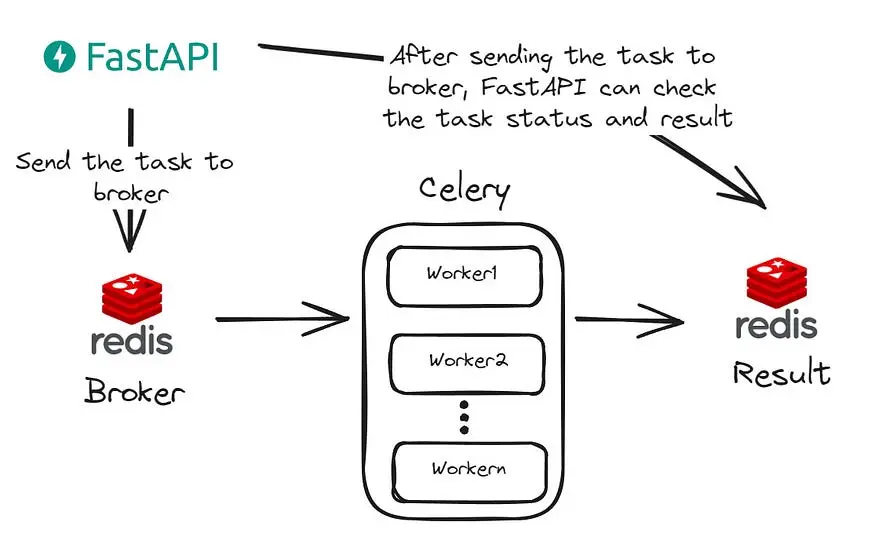
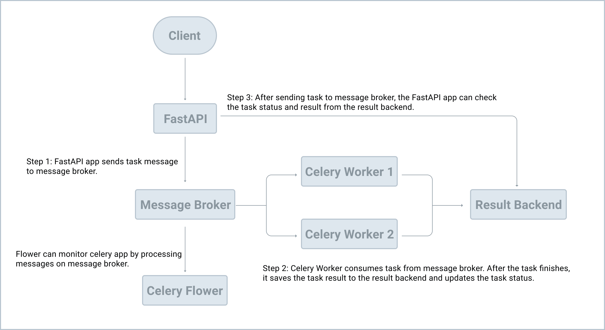
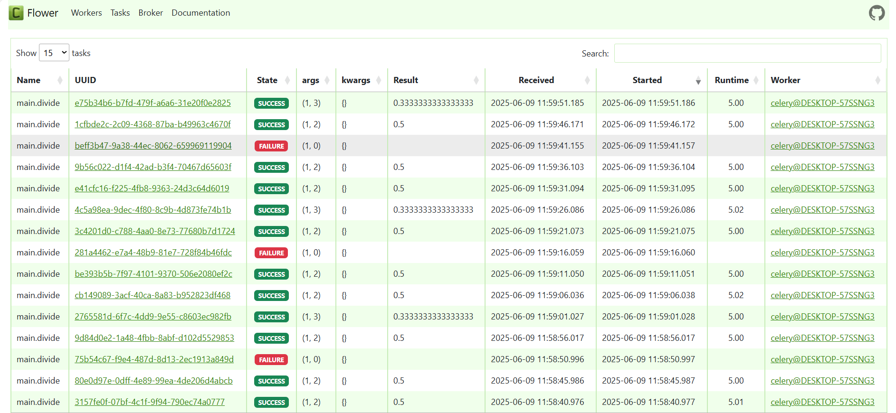

# ⚙️ Celery - Distributed Task Queue

**Celery** is a distributed task queue that focuses on real-time processing, while also supporting task scheduling.

> 🐍 **It is the most popular task queue in Python.**

Celery allows you to return an HTTP response immediately and run long-running processes in the background, so users don't have to wait for the task to complete.

---

## ⚖️ Celery vs FastAPI’s `BackgroundTasks`

### When should you use **Celery** instead of FastAPI's built-in `BackgroundTasks`?

#### 1. **CPU-Intensive or Time-Consuming Tasks**

Use Celery when the task involves heavy computation, file processing, or long-running operations. FastAPI’s `BackgroundTasks` runs in the same event loop as your main app and is better suited for lightweight, non-blocking operations.

#### 2. **Task Management and Status Tracking**

If you need to:

* Manage a **queue** of tasks
* **Distribute** tasks to multiple workers
* **Track** task status
* **Retry** failed tasks
* **Schedule** recurring tasks

...then **Celery** is the right tool. It’s built for robust background task orchestration.

---

## 🧪 Example Notes

1. After creating your FastAPI app, create a separate instance of Celery.
2. Configure the **broker** and **backend** (e.g., Redis).
3. Avoid hardcoding config values — use environment variables or a `.env` file.
4. Define your Celery tasks (e.g., a long-running task like `divide`).

---

## 🔄 What is a Task Queue?

A **task queue** is a mechanism to offload:

* **Time-intensive**
* **CPU- or memory-heavy**
* **Unreliable or third-party dependent**

...operations to a **separate process**, preventing the main application from being blocked.

> Think of it as a background worker system with its own job list.

To use a task queue like Celery:

* You need a **broker** (message driver) such as Redis or RabbitMQ.
* Celery connects to the broker and listens for tasks to process.



---

## 💾 Redis — In-Memory Data Store

**Redis** is a high-performance, in-memory key-value store, often used as:

* A **message broker** (Celery needs this)
* A **cache**
* An **in-memory database**

---

### ✅ Common Redis Use Cases

* **Real-Time Analytics:** e.g., fraud detection
* **Session Storage:** for fast web session retrieval
* **Gaming Leaderboards:** for fast sorting and updates in games

---

## 📦 Installation

### Install Celery

```bash
pip install celery
```

### Install Redis (Python client)

```bash
pip install redis
```

> ⚠️ You also need an actual Redis server running. You can use **Docker** or **Docker Compose** for that.

### Example Docker Compose snippet for Redis

```yaml
services:
  redis:
    image: redis:latest
    ports:
      - "6379:6379"
```

---

## 🧠 In-Memory Database vs. Cache

| Feature         | In-Memory Database         | Cache                          |
| --------------- | -------------------------- | ------------------------------ |
| **Purpose**     | Primary data store         | Temporary, fast-access storage |
| **Persistence** | Persistent (optional)      | Usually non-persistent         |
| **Use Case**    | Session storage, analytics | Speed up frequent reads        |
| **Durability**  | Higher                     | Volatile                       |
| **Scalability** | High                       | Limited by memory              |

**Summary:**

* Use a **cache** to optimize **read performance**.
* Use an **in-memory DB** to **store and process live data** quickly.

---

## ▶️ Running Celery

### Run Python File (Interactive Mode)

```bash
python -i task.py
```

### Start Celery Worker

#### For Linux/macOS

```bash
celery -A task worker -l info
```

#### For Windows

```bash
celery -A task worker --pool=solo -l info
```

#### Alternate Examples

```bash
celery -A app.celery_worker.celery worker --loglevel=info
celery -A main.celery worker --loglevel=info
```

---


## Message broker and Result backend

* Message broker is an intermediary program used as the transport for producing or consuming tasks.
* Result backend is used to store the result of a Celery task.

> The Celery client is the producer which adds a new task to the queue via the message broker. Celery workers then consume new tasks from the queue, again, via the message broker. Once processed, results are then stored in the result backend.

In terms of tools, RabbitMQ is arguably the better choice for a message broker since it supports AMQP (Advanced Message Queuing Protocol) while Redis is fine as your result backend.

 step-by-step format:

---

## 🌱 **Celery Task Lifecycle**

```
[Your App] --> [Broker (Redis/RabbitMQ)] --> [Celery Worker] --> [Result Backend (Optional)]
```

---

### 🔹 1. **Task Creation (Producer Phase)**

* You (the developer) call a Celery task using `.delay()` or `.apply_async()`.
* This sends the **task request** to the **message broker**.

```python
my_task.delay(arg1, arg2)
```

---

### 🔹 2. **Message Queuing (Broker Phase)**

* Celery **serializes** the task and **pushes** it into the **message queue** (e.g., Redis, RabbitMQ).
* The broker **queues** tasks until workers are available.

---

### 🔹 3. **Task Execution (Worker Phase)**

* Celery **workers** continuously listen for new tasks from the broker.
* When a task is available:

  * The worker **picks it up**, **deserializes** it, and **executes** the Python function you defined.

---

### 🔹 4. **Result Handling (Optional)**

* If you’ve configured a **result backend** (e.g., Redis, database, S3):

  * The worker **stores the result** of the task there.
  * You can later **fetch the result** using `.get()` on the task's AsyncResult.

```python
result = my_task.delay(5, 6)
print(result.get())  # waits for the task to finish and returns result
```

---

### 🔹 5. **Monitoring & Retries**

* Celery supports:

  * **Retries** (for failed tasks)
  * **Error handling**
  * **Timeouts**
  * **Task expiration**
* You can monitor task status using tools like **Flower**, Prometheus exporters, etc.

---

## 🧠 Visual Summary

```text
App --> Broker --> Worker --> Result Backend
 ↑                             ↓
 Retry / Timeout        Result status (SUCCESS / FAILURE)
```

---

### ⚙️ Example Settings in `celeryconfig.py`

```python
broker_url = 'redis://localhost:6379/0'
result_backend = 'redis://localhost:6379/1'
task_serializer = 'json'
result_serializer = 'json'
accept_content = ['json']
timezone = 'UTC'
```

---






1. The Celery client (the producer) adds a new task to the queue via the message broker.
2. The Celery worker (the consumer) grabs the tasks from the queue, again, via the message broker.
3. Once processed, results are stored in the result backend.

### With Docker

```sh
docker run -p 6379:6379 --name some-redis -d redis
```

This downloads the official Redis Docker image from Docker Hub and runs it on port 6379 in the background.

To test if Redis is up and running, run:

```sh
docker exec -it some-redis redis-cli ping
```

### Sending a Task to Celery

```sh
celery -A main.celery worker --loglevel=info
```

```py
from main import app, divide
task = divide.delay(1, 2)

```

What's happening?

1. We used the delay method to send a new message to the message broker. The worker process then picked up and executed the task from the queue.
2. After releasing from the Enter key, the code finished executing while the divide task ran in the background.

```sh
task = divide.delay(1, 2)
task.state
task.result
```

```py
from celery.result import AsyncResult
task = AsyncResult('8e3da1cc-a6aa-42ba-ab72-6ca7544d3730')  # replace with your UUID
```

After we called the delay method, we get an AsyncResult instance, which can be used to check the task state along with the return value or exception details

## Monitoring Celery with Flower

Flower is a real-time web application monitoring and administration tool for Celery.

Familiarize yourself a bit with the Flower dashboard.
Take note of the UUID column. This is the id of AsyncResult

```sh
celery -A main.celery flower --port=5555
```

print `task.state` and `task.result`

## Setting up Redis

You can set up and run Redis directly from your operating system or from a Docker container.

o/p
PONG

```py
from celery.result import AsyncResult
task = AsyncResult('8e3da1cc-a6aa-42ba-ab72-6ca7544d3730')  # replace with your UUID
task.state

# 'FAILURE'
task.result
```



* Celery doesn't support asyncio very well (since it was developed before asyncio), we're using SQLAlchemy as our ORM because it can be used with both FastAPI and Celery.

* Alembic is a database migration tool for SQLAlchemy.

config.py

```py
import os
import pathlib
from functools import lru_cache


class BaseConfig:
    BASE_DIR: pathlib.Path = pathlib.Path(__file__).parent.parent

    DATABASE_URL: str = os.environ.get("DATABASE_URL", f"sqlite:///{BASE_DIR}/db.sqlite3")
    DATABASE_CONNECT_DICT: dict = {}


class DevelopmentConfig(BaseConfig):
    pass


class ProductionConfig(BaseConfig):
    pass


class TestingConfig(BaseConfig):
    pass


@lru_cache()
def get_settings():
    config_cls_dict = {
        "development": DevelopmentConfig,
        "production": ProductionConfig,
        "testing": TestingConfig
    }

    config_name = os.environ.get("FASTAPI_CONFIG", "development")
    config_cls = config_cls_dict[config_name]
    return config_cls()


settings = get_settings()

```

* In get_settings, we used the FASTAPI_CONFIG env variable to control which configuration to use. For example, during development, DevelopmentConfig will be used and TestingConfig will be used during test.
* I do not recommend pydantic BaseSettings here because it might cause Celery to raise [ERROR/MainProcess] pidbox command error: KeyError('**signature**') error when we launch Flower

## Init Alembic

```
alembic init alembic
```

```py
config.set_main_option("sqlalchemy.url", str(settings.DATABASE_URL))        # new
fastapi_app = create_app()    # new
target_metadata = Base.metadata       # new
```

### Notes

1. We used `config.set_main_option("sqlalchemy.url", str(settings.DATABASE_URL))` to set the database connection string.
2. Then, we used `create_app` to create a new `fastapi_app` instance to ensure the relevant models are loaded.
3. Finally, we added `target_metadata = Base.metadata` so that new models are discovered by Alembic.

### To create an empty db.sqlite3, run

```sh
python
from main import app
from app.database import Base, engine
Base.metadata.create_all(bind=engine)
exit()

(venv)ls db.sqlite3
db.sqlite3
```

### migrate the database even though we don't have any models yet

`alembic revision --autogenerate`

## Application Structure

If you have experience with Django or Flask, you've probably used "Django Apps" or "Flask Blueprints" to break up larger applications by grouping common functionality into reusable components.

Next, we'll do the same thing for FastAPI.

we can use somthing like

```py
from fastapi import APIRouter

users_router = APIRouter(
    prefix="/users",
)

from . import models # noqa
```

### Database Operations

alembic revision --autogenerate

#### Create users table

alembic upgrade head

```sh
from main import app
from app.database import SessionLocal
from app.users.models import User

user = User(username='test1', user_email='test1@example.com', user_password='test1')
session = SessionLocal()
session.add(user)
session.commit()

new_session = SessionLocal()
new_session.query(User).first().username

'test1'

exit()

```

## Add Celery

```py
from celery import current_app as current_celery_app

from project.config import settings


def create_celery():
    celery_app = current_celery_app
    celery_app.config_from_object(settings, namespace="CELERY")

    return celery_app

```

### Notes

1. `create_celery` is a factory function that configures and then returns a Celery app instance.
2. Rather than creating a new Celery instance, we used current_app so that shared tasks will work as expected.
3. `celery_app.config_from_object(settings, namespace="CELERY")` means all celery-related configuration keys should be prefixed with `CELERY_`. For example, to configure the `broker_url`, we should use `CELERY_BROKER_URL`

### tasks

```py
from celery import shared_task


@shared_task
def divide(x, y):
    import time
    time.sleep(5)
    return x / y
```

**Notes:**

1. Many resources on the web recommend using `celery.task`. This might cause circular imports since you'll have to import the Celery instance.
2. We used `shared_task` to make our code reusable, which, again, requires current_app in `create_celery` instead of creating a new Celery instance.Now, we can copy this file anywhere in the app and it will work as expected.

Celery tasks will be found when we launch the worker.

## Manual Test

```
celery -A main.celery worker --loglevel=info
celery -A main.celery worker --pool=solo -l info 

```

[tasks]
  . app.users.tasks.divide

Note: From the tasks section above, we can see project.users.tasks.divide, which means that the Celery worker found the task successfully.

## Dockerizing Celery and FastAPI

Docker Compose

Docker Compose is a tool used for defining and running multi-container Docker applications. It uses YAML files to configure the application's services and performs the creation and start-up processes for all of the containers with a single command.

We've already looked at how to serve up an instance of Redis with Docker using a single command:

$ docker run -p 6379:6379 --name some-redis -d redis

Well, in this chapter, we'll take this a step further and containerize our entire infrastructure to simplify development. Before we do that though, let's look at the why: Why should we serve up our development environment in Docker containers with Docker Compose?

    Instead of having to run each process (e.g., Uvicorn/FastAPI, Celery worker, Celery beat, Flower, Redis, Postgres, etc.) manually, each from a different terminal window, after we containerize each service, Docker Compose enables us to manage and run the containers using a single command.
    Docker Compose will also simplify configuration. The Celery config is currently tied to our FastAPI app's config. This is not ideal. With Docker Compose, we can easily create different configurations for both FastAPI and Celery all from a single YAML file.
    Docker, in general, allows us to create isolated, reproducible, and portable development environments. So, you won't have to mess around with a virtual environment or install tools like Postgres and Redis on your local OS.

The "compose" folder holds configuration files, shell scripts, and the associated Dockerfiles for each environment.


```yaml
services:
  web:
    build:
      context: .
      dockerfile: ./compose/local/fastapi/Dockerfile
    image: fastapi_celery_example_web
    # '/start' is the shell script used to run the service
    command: /start
    # this volume is used to map the files and folders on the host to the container
    # so if we change code on the host, code in the docker container will also be changed
    volumes:
      - .:/app
    ports:
      - 8010:8000
    env_file:
      - .env/.dev-sample
    depends_on:
      - redis
      - db

  db:
    image: postgres:16-alpine
    volumes:
      - postgres_data:/var/lib/postgresql/data/
    environment:
      - POSTGRES_DB=fastapi_celery
      - POSTGRES_USER=fastapi_celery
      - POSTGRES_PASSWORD=fastapi_celery

  redis:
    image: redis:7-alpine

  celery_worker:
    build:
      context: .
      dockerfile: ./compose/local/fastapi/Dockerfile
    image: fastapi_celery_example_celery_worker
    command: /start-celeryworker
    volumes:
      - .:/app
    env_file:
      - .env/.dev-sample
    depends_on:
      - redis
      - db

  celery_beat:
    build:
      context: .
      dockerfile: ./compose/local/fastapi/Dockerfile
    image: fastapi_celery_example_celery_beat
    command: /start-celerybeat
    volumes:
      - .:/app
    env_file:
      - .env/.dev-sample
    depends_on:
      - redis
      - db

  flower:
    build:
      context: .
      dockerfile: ./compose/local/fastapi/Dockerfile
    image: fastapi_celery_example_celery_flower
    command: /start-flower
    volumes:
      - .:/app
    env_file:
      - .env/.dev-sample
    ports:
      - 5557:5555
    depends_on:
      - redis
      - db

volumes:
  postgres_data:
```

we defined six services:

1. web is the FastAPI server
2. db is the Postgres server
3. redis is the Redis service, which will be used as the Celery message broker and result backend
4. celery_worker is the Celery worker process
5. celery_beat is the Celery beat process for scheduled tasks
6. flower is the Celery dashboard

Review the web, db, and redis services on your own, taking note of the comments. To simplify things, the web, celery_worker, celery_beat, and flower services will all use the same Dockerfile.

## Environment Variables

Create a new folder to store environment variables in the project root called .env. Then, add a new file to that folder called .dev-sample:
