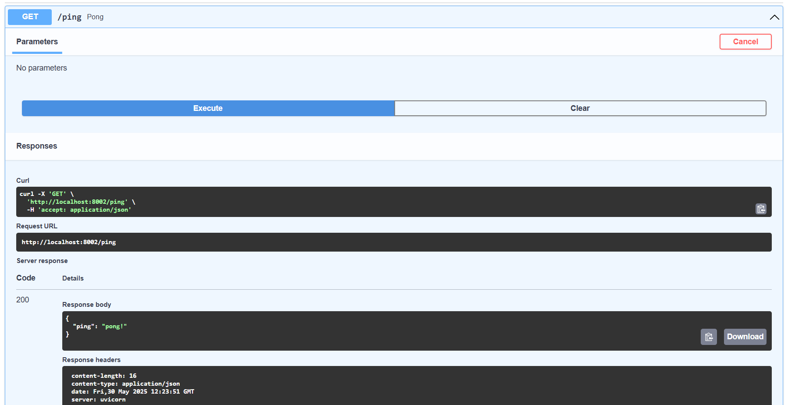

# FastAPI

FastAPI is a modern, high-performance, batteries-included Python web framework that's perfect for building RESTful APIs. It can handle both synchronous and asynchronous requests and has built-in support for data validation, JSON serialization, authentication and authorization, and OpenAPI (version 3.0.2 as of writing) documentation.

Highlights:

1. It takes advantage of Python type hints for parameter declaration which enables data validation (via Pydantic) and OpenAPI/Swagger documentation.
2. Built on top of Starlette, it supports the development of asynchronous APIs.
3. It's fast. Since async is much more efficient than the traditional synchronous threading model, it can compete with Node and Go with regards to performance.

You should now have:

```yaml
fastapi-crud
    ├── docker-compose.yml
    └── src
        ├── Dockerfile
        ├── app
        │   ├── __init__.py
        │   └── main.py
        └── requirements.txt
```

Unlike Django or Flask, FastAPI does not have a built-in development server. So, we'll use Uvicorn, an ASGI server, to serve up FastAPI.

Then, within main.py, create a new instance of FastAPI and set up a sanity check route:

```py
from fastapi import FastAPI

app = FastAPI()


@app.get("/ping")
def pong():
    return {"ping": "pong!"}
```

Install Docker, if you don't already have it, and then update the Dockerfile in the "src" directory:

```yaml
# pull official base image
FROM python:3.11.0-alpine

# set work directory
WORKDIR /usr/src/app

# set environment variables
ENV PYTHONDONTWRITEBYTECODE 1
ENV PYTHONUNBUFFERED 1

# copy requirements file
COPY ./requirements.txt /usr/src/app/requirements.txt

# install dependencies
RUN set -eux \
    && apk add --no-cache --virtual .build-deps build-base \
         openssl-dev libffi-dev gcc musl-dev python3-dev \
    && pip install --upgrade pip setuptools wheel \
    && pip install -r /usr/src/app/requirements.txt \
    && rm -rf /root/.cache/pip

# copy project
COPY . /usr/src/app/
```

So, we started with an Alpine-based Docker image for Python 3.11.0. We then set a working directory along with two environment variables:

`PYTHONDONTWRITEBYTECODE`: Prevents Python from writing pyc files to disc (equivalent to python -B option)
`PYTHONUNBUFFERED`: Prevents Python from buffering stdout and stderr (equivalent to python -u option)

Next, add the following to the docker-compose.yml file in the project root:

```yaml
version: '3.8'

services:
  web:
    build: ./src
    command: uvicorn app.main:app --reload --workers 1 --host 0.0.0.0 --port 8000
    volumes:
      - ./src/:/usr/src/app/
    ports:
      - 8002:8000
```

So, when the container spins up, Uvicorn will run with the following settings:

1. --reload enables auto-reload so the server will restart after changes are made to the code base.
2. --workers 1 provides a single worker process.
3. --host 0.0.0.0 defines the address to host the server on.
4. --port 8000 defines the port to host the server on.

`app.main:app` tells Uvicorn where it can find the FastAPI ASGI application -- i.e., "within the 'app' module, you'll find the ASGI app, `app = FastAPI()`, in the 'main.py' file.

Build the image and spin up the container:

```yaml
docker-compose up -d --build
```

Navigate to <http://localhost:8002/ping>. You should see:

```json
{
  "ping": "pong!"
}
```

You'll also be able to view the interactive API documentation, powered by Swagger UI, at <http://localhost:8002/docs>:



## Test Setup

