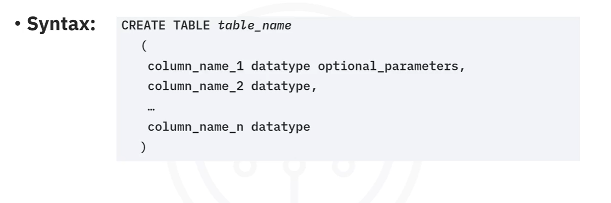
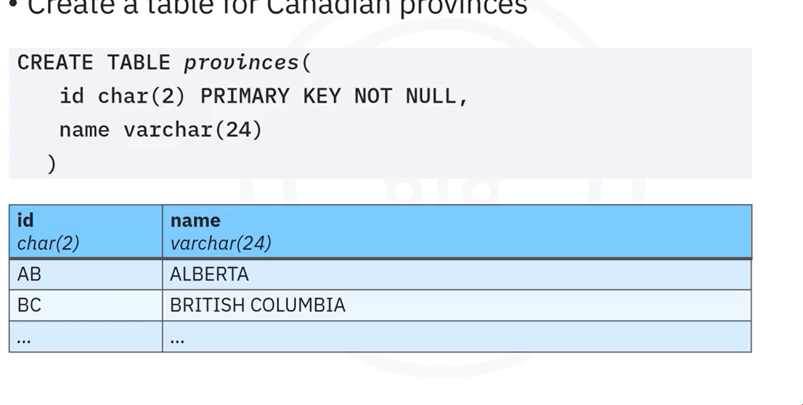
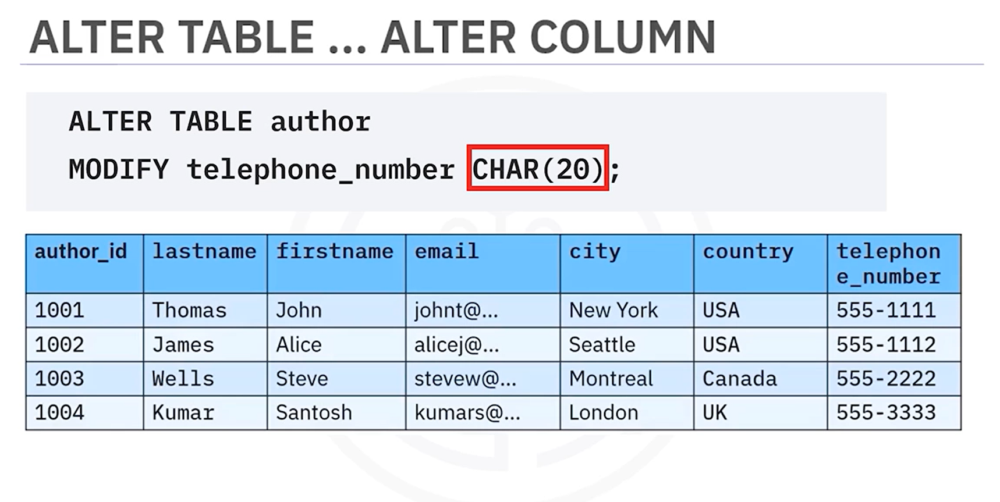
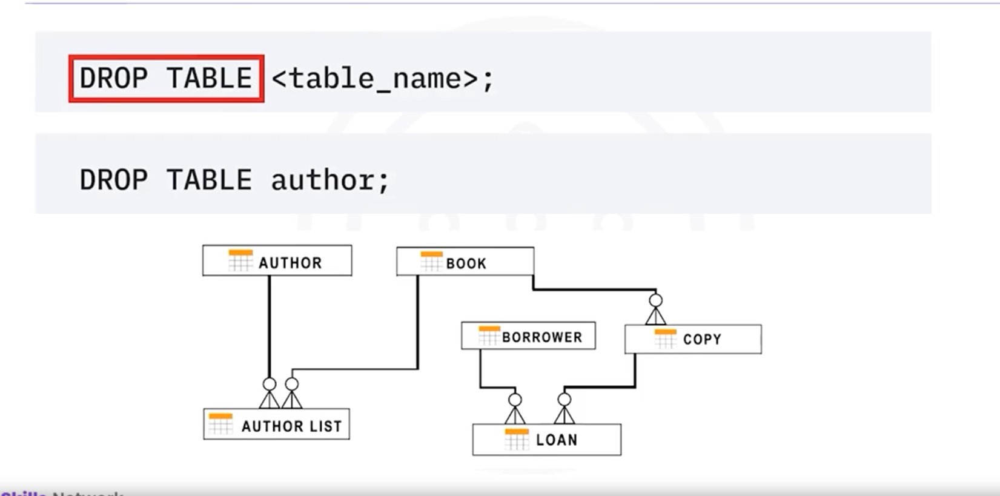
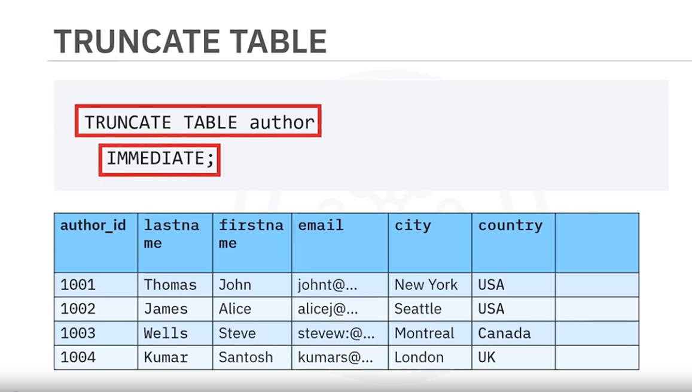
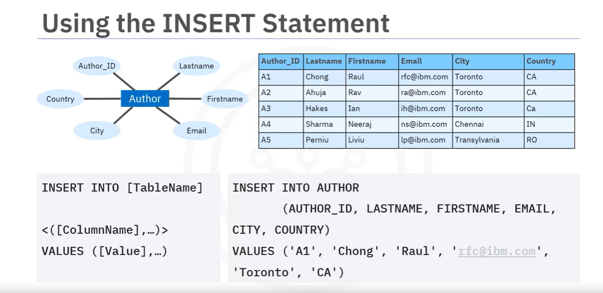
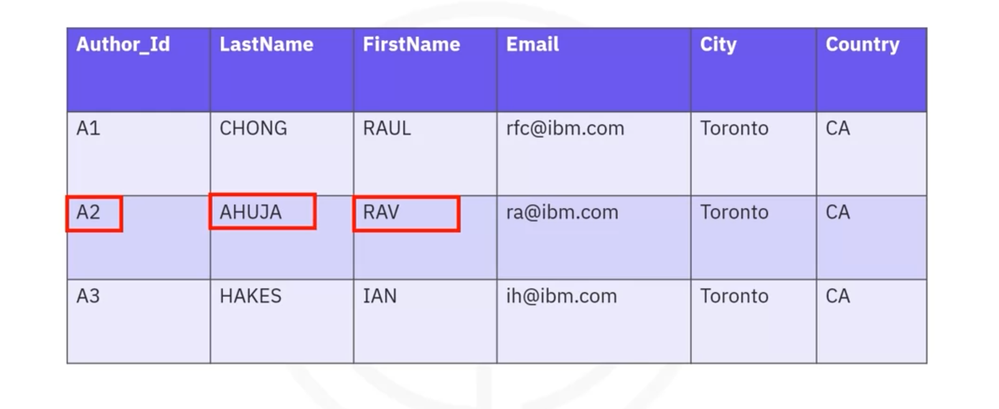

# Create table

Create Table author






## Alter table Add Column

- Add or remove columns
- Modify the data type of columns
- Add or remove keys
- Add or remove constranis
  - After Table tablename
         -Add columnname datatype

## Modify

Alter table tablename

- modify column name datatype;






%load_ext sql
%sql sqlite:///DA.db

```sql

%%sql 
    
CREATE TABLE PETSALE (
        ID INTEGER NOT NULL,
        PET CHAR(20),
        SALEPRICE DECIMAL(6,2),
        PROFIT DECIMAL(6,2),
        SALEDATE DATE
        );

CREATE TABLE PET (
        ID INTEGER NOT NULL,
        ANIMAL VARCHAR(20),
        QUANTITY INTEGER
        );
```

```sql
%%sql
INSERT INTO PETSALE VALUES
        (1,'Cat',450.09,100.47,'2018-05-29'),
        (2,'Dog',666.66,150.76,'2018-06-01'),
        (3,'Parrot',50.00,8.9,'2018-06-04'),
        (4,'Hamster',60.60,12,'2018-06-11'),
        (5,'Goldfish',48.48,3.5,'2018-06-14');
        
INSERT INTO PET VALUES
        (1,'Cat',3),
        (2,'Dog',4),
        (3,'Hamster',2);

SELECT * FROM PETSALE;
SELECT * FROM PET;
```

<table>
    <thead>
        <tr>
            <th>ID</th>
            <th>ANIMAL</th>
            <th>QUANTITY</th>
        </tr>
    </thead>
    <tbody>
        <tr>
            <td>1</td>
            <td>Cat</td>
            <td>3</td>
        </tr>
        <tr>
            <td>2</td>
            <td>Dog</td>
            <td>4</td>
        </tr>
        <tr>
            <td>3</td>
            <td>Hamster</td>
            <td>2</td>
        </tr>
    </tbody>
</table>

```sql
%%sql
SELECT * FROM PETSALE;

```

<table>
    <thead>
        <tr>
            <th>ID</th>
            <th>PET</th>
            <th>SALEPRICE</th>
            <th>PROFIT</th>
            <th>SALEDATE</th>
        </tr>
    </thead>
    <tbody>
        <tr>
            <td>1</td>
            <td>Cat</td>
            <td>450.09</td>
            <td>100.47</td>
            <td>2018-05-29</td>
        </tr>
        <tr>
            <td>2</td>
            <td>Dog</td>
            <td>666.66</td>
            <td>150.76</td>
            <td>2018-06-01</td>
        </tr>
        <tr>
            <td>3</td>
            <td>Parrot</td>
            <td>50</td>
            <td>8.9</td>
            <td>2018-06-04</td>
        </tr>
        <tr>
            <td>4</td>
            <td>Hamster</td>
            <td>60.6</td>
            <td>12</td>
            <td>2018-06-11</td>
        </tr>
        <tr>
            <td>5</td>
            <td>Goldfish</td>
            <td>48.48</td>
            <td>3.5</td>
            <td>2018-06-14</td>
        </tr>
    </tbody>
</table>

### 1. Adding a column

Add a new column named QUANTITY to the PETSALE table and display the altered table.
For this, copy the code below and paste it into the text area of the SQL page. Click Go.

```sql
%%sql
ALTER TABLE PETSALE
ADD COLUMN QUANTITY INTEGER;

SELECT * FROM PETSALE;
```

<table>
    <thead>
        <tr>
            <th>ID</th>
            <th>PET</th>
            <th>SALEPRICE</th>
            <th>PROFIT</th>
            <th>SALEDATE</th>
            <th>QUANTITY</th>
        </tr>
    </thead>
    <tbody>
        <tr>
            <td>1</td>
            <td>Cat</td>
            <td>450.09</td>
            <td>100.47</td>
            <td>2018-05-29</td>
            <td>None</td>
        </tr>
        <tr>
            <td>2</td>
            <td>Dog</td>
            <td>666.66</td>
            <td>150.76</td>
            <td>2018-06-01</td>
            <td>None</td>
        </tr>
        <tr>
            <td>3</td>
            <td>Parrot</td>
            <td>50</td>
            <td>8.9</td>
            <td>2018-06-04</td>
            <td>None</td>
        </tr>
        <tr>
            <td>4</td>
            <td>Hamster</td>
            <td>60.6</td>
            <td>12</td>
            <td>2018-06-11</td>
            <td>None</td>
        </tr>
        <tr>
            <td>5</td>
            <td>Goldfish</td>
            <td>48.48</td>
            <td>3.5</td>
            <td>2018-06-14</td>
            <td>None</td>
        </tr>
    </tbody>
</table>

#### Now update the newly added QUANTITY column of the PETSALE table with some values and show all the table records. Copy the code below and paste it into text area of the SQL page. Click Go

```sql
%%sql

UPDATE PETSALE SET QUANTITY = 9 WHERE ID = 1;
UPDATE PETSALE SET QUANTITY = 3 WHERE ID = 2;
UPDATE PETSALE SET QUANTITY = 2 WHERE ID = 3;
UPDATE PETSALE SET QUANTITY = 6 WHERE ID = 4;
UPDATE PETSALE SET QUANTITY = 24 WHERE ID = 5;

SELECT * FROM PETSALE;
```

<table>
    <thead>
        <tr>
            <th>ID</th>
            <th>PET</th>
            <th>SALEPRICE</th>
            <th>PROFIT</th>
            <th>SALEDATE</th>
            <th>QUANTITY</th>
        </tr>
    </thead>
    <tbody>
        <tr>
            <td>1</td>
            <td>Cat</td>
            <td>450.09</td>
            <td>100.47</td>
            <td>2018-05-29</td>
            <td>9</td>
        </tr>
        <tr>
            <td>2</td>
            <td>Dog</td>
            <td>666.66</td>
            <td>150.76</td>
            <td>2018-06-01</td>
            <td>3</td>
        </tr>
        <tr>
            <td>3</td>
            <td>Parrot</td>
            <td>50</td>
            <td>8.9</td>
            <td>2018-06-04</td>
            <td>2</td>
        </tr>
        <tr>
            <td>4</td>
            <td>Hamster</td>
            <td>60.6</td>
            <td>12</td>
            <td>2018-06-11</td>
            <td>6</td>
        </tr>
        <tr>
            <td>5</td>
            <td>Goldfish</td>
            <td>48.48</td>
            <td>3.5</td>
            <td>2018-06-14</td>
            <td>24</td>
        </tr>
    </tbody>
</table>

#### 2. Deleting a column

Delete the PROFIT column from the PETSALE table and show the altered table. Copy the code below and paste it into the text area of the SQL page.

```sql
%%sql

ALTER TABLE PETSALE
DROP COLUMN PROFIT;

SELECT * FROM PETSALE;
```

<table>
    <thead>
        <tr>
            <th>ID</th>
            <th>PET</th>
            <th>SALEPRICE</th>
            <th>SALEDATE</th>
            <th>QUANTITY</th>
        </tr>
    </thead>
    <tbody>
        <tr>
            <td>1</td>
            <td>Cat</td>
            <td>450.09</td>
            <td>2018-05-29</td>
            <td>9</td>
        </tr>
        <tr>
            <td>2</td>
            <td>Dog</td>
            <td>666.66</td>
            <td>2018-06-01</td>
            <td>3</td>
        </tr>
        <tr>
            <td>3</td>
            <td>Parrot</td>
            <td>50</td>
            <td>2018-06-04</td>
            <td>2</td>
        </tr>
        <tr>
            <td>4</td>
            <td>Hamster</td>
            <td>60.6</td>
            <td>2018-06-11</td>
            <td>6</td>
        </tr>
        <tr>
            <td>5</td>
            <td>Goldfish</td>
            <td>48.48</td>
            <td>2018-06-14</td>
            <td>24</td>
        </tr>
    </tbody>
</table>

#### 3. Modify a column

Change the data type to VARCHAR(20) type of the column PET of the table PETSALE and show the altered table. Copy the code below and paste it into the text area of the SQL

```sql
%%sql

ALTER TABLE PETSALE
MODIFY PET VARCHAR(20);

SELECT * FROM PETSALE;
```

#### In SQLite, you cannot directly modify a column's data type with the ALTER TABLE command like you can in MySQL or PostgreSQL. SQLite has limited support for altering columns. To modify a column in SQLite, you typically need to create a new table with the desired structure, copy the data, and then drop the old table

#### 4. Rename a Column

Rename the column PET to ANIMAL of the PETSALE table and show the altered table. Copy the code below and paste it into the text area of the SQL page.

```sql
%%sql

ALTER TABLE `PETSALE` CHANGE `PET` `ANIMAL` varchar(20);

SELECT * FROM PETSALE;
```

```sql
%%sql

ALTER TABLE PETSALE
RENAME COLUMN PET TO ANIMAL;

SELECT * FROM PETSALE;
```

<table>
    <thead>
        <tr>
            <th>ID</th>
            <th>ANIMAL</th>
            <th>SALEPRICE</th>
            <th>SALEDATE</th>
            <th>QUANTITY</th>
        </tr>
    </thead>
    <tbody>
        <tr>
            <td>1</td>
            <td>Cat</td>
            <td>450.09</td>
            <td>2018-05-29</td>
            <td>9</td>
        </tr>
        <tr>
            <td>2</td>
            <td>Dog</td>
            <td>666.66</td>
            <td>2018-06-01</td>
            <td>3</td>
        </tr>
        <tr>
            <td>3</td>
            <td>Parrot</td>
            <td>50</td>
            <td>2018-06-04</td>
            <td>2</td>
        </tr>
        <tr>
            <td>4</td>
            <td>Hamster</td>
            <td>60.6</td>
            <td>2018-06-11</td>
            <td>6</td>
        </tr>
        <tr>
            <td>5</td>
            <td>Goldfish</td>
            <td>48.48</td>
            <td>2018-06-14</td>
            <td>24</td>
        </tr>
    </tbody>
</table>

#### In SQLite, the CHANGE keyword is not supported for renaming columns like it is in MySQL. Instead, you can use the ALTER TABLE ... RENAME COLUMN command

#### Task 4: TRUNCATE statement

In this exercise, you will use the TRUNCATE statement to remove all rows from an existing table without deleting it.

Let's remove all rows from the PET table and show the empty table. Copy the code below and paste it into the text area of the SQL

```sql
%%sql

TRUNCATE TABLE PET ;

SELECT * FROM PET;

```

#### SQLite does not support the TRUNCATE TABLE command like some other databases (e.g., MySQL, PostgreSQL). However, you can achieve the same effect of removing all rows from a table using the DELETE statement or the DROP and CREATE combination

```sql
%%sql
DELETE FROM PET;

%%sql
SELECT * FROM PET;

```

<table>
    <thead>
        <tr>
            <th>ID</th>
            <th>ANIMAL</th>
            <th>QUANTITY</th>
        </tr>
    </thead>
    <tbody>
    </tbody>
</table>

#### Task 5: DROP statement

Finally, you will use the DROP statement to delete an existing table. Let's delete the PET table and verify if the table still exists or not (the SELECT statement should give an error if a table doesn't exist)

```sql
%%sql

DROP TABLE PET;

SELECT * FROM PET;
```

(sqlite3.OperationalError) no such table: PET

## Insert Statement

Adding rows to a table

- Create the table(CREATE TABLE statement)
- Populate table with data
  - INSERT statement
    - a Data Manipulation Language(DML) statement used to read and modify data
    - 

```sql
%load_ext sql
%sql sqlite:///DA.db

%%sql
Insert into author (author_id, lastname,firstname, email, city, country)
values("a1","chong", "Raul", "rfc@ibm.com", "toronto","ca")

```
## Update

