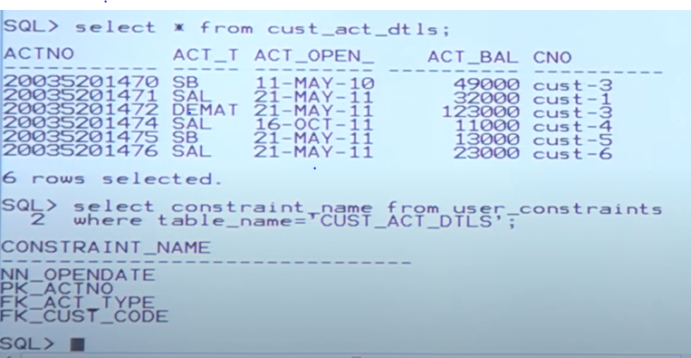

# indexes praticle

- if you define a primary key on your table oravle engin internally maintains a default index on each primary key.
- as a developer we have not created any index explicitly til now.
- to select how many tables are there write `select * from tab;`
- to check that whater primary key is ablable in colunm or not
    `select constraint_name from user_constraints where table_name = 'CUST_ACT_DTLS'`
- 
- to clear screen use cl scr;

## To check index information

- in oracle each catogary of objects shoild be maintained under one system define table
- all tables information is maintained under user_tables
- all views information is maintained under user_views
- simlarly all index information is maintained under user_indexes.

## What are columns in the system define tables user_indexes

`desc user_indexes`