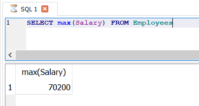

# Interview prepration

## create a table with some value

```sql
- Create the table
        CREATE TABLE Employees (
            ID INT PRIMARY KEY,
            FirstName VARCHAR(50),
            LastName VARCHAR(50),
            Gender VARCHAR(10),
            Salary DECIMAL(10,2)
        );

- Insert the data
    INSERT INTO Employees (ID, FirstName, LastName, Gender, Salary) VALUES
    (1001, 'Emily', 'Johnson', 'Female', 55000.00),
    (1002, 'David', 'Smith', 'Male', 62500.00),
    (1003, 'Sarah', 'Brown', 'Female', 48000.00),
    (1004, 'Michael', 'Davis', 'Male', 70200.00),
    (1005, 'Amanda', 'Wilson', 'Female', 42800.00),
    (1006, 'Christopher', 'Martinez', 'Male', 58300.00),
    (1007, 'Jessica', 'Thompson', 'Female', 51700.00),
    (1008, 'Matthew', 'Garcia', 'Male', 65900.00),
    (1009, 'Ashley', 'White', 'Female', 47600.00),
    (1010, 'Daniel', 'Miller', 'Male', 53400.00);
```

1. How to find nth highest salary in SQL?

- There are several ways of finding the nth highest salary.
  - HOW to find nth highest salary in SQL Server using a Sub-Query
  - How to find nth higest salary in SQ: Derver using CTE
  - How to find the 2nd,3rd or 15th highest salary

## Find the highest salary straight forward

1. Simply use Max() function as shown below.

    ```sql
    SELECT max(Salary) FROM Employees
    ```

    

2. To find the Second highest salary use a sub query along with Max() function as shown below

    ```sql

        - SELECT max(Salary) FROM Employees 
    WHERE Salary < (SELECT max(Salary) FROM Employees)
    ```

    

- SELECT DISTINCT TOP 2 Salary from Employees ORDER BY Salary DESC; in SQL server
- SELECT DISTINCT Salary from Employees ORDER BY Salary DESC LIMIT 2;

## 2nd highest salary

### To find  nth highest salary using Sub-Query

  ```sql
    SELECT salary from (SELECT DISTINCT Salary from Employees ORDER BY Salary DESC LIMIT 2) Result ORDER by Salary LIMIT 1;
  ```

  

  ```sql
    WITH Result AS (SELECT Salary, dense_rank() over(order by Salary DESC) AS DENSERANK FROM Employees)SELECT Salary FROM Result WHERE Result.DENSERANK = 2 limit 1
  ```

  

How to find nth  higest salary in SQL
***Please Note:*** On many of the websites, you have seen that, the following query can be used to get nth higest salary. The below query query will only work if there are no dublicates.

  ```sql
    WITH Result AS 
    (SELECT Salary, row_number() over(order by Salary DESC) AS ROWNUM
    FROM Employees)

    SELECT Salary
    FROM Result
    WHERE Result.ROWNUM = 2;
  ```

  

1. Employees table contains EmployeeId, EMployeeName& ManagerID cloumns
2. If an EMployeeID is passed, the query should list doun the entire organsiztion hierarchy i.e who is the manager of the EmployeeID passed and who is managers manger and so on till hull hierarchy is listed.

