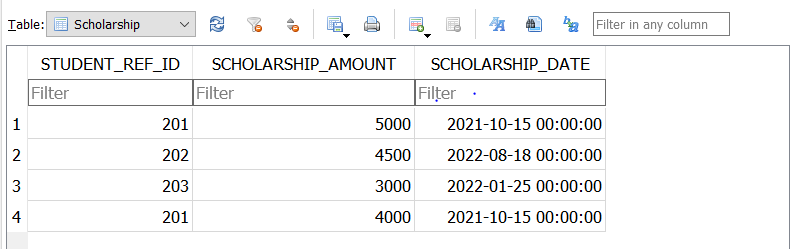
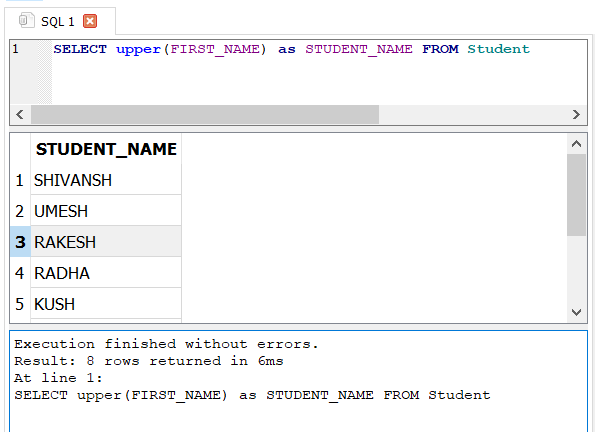
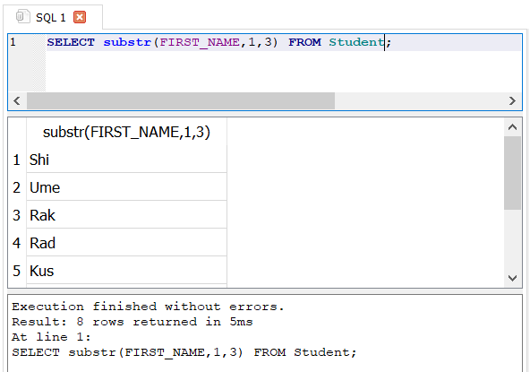
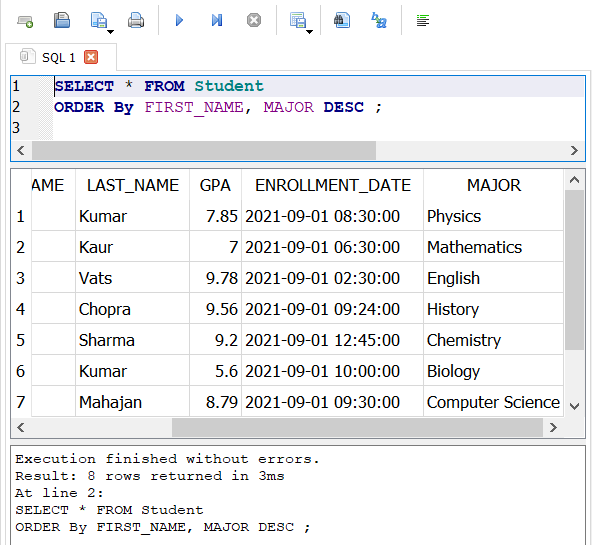
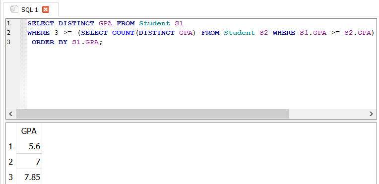
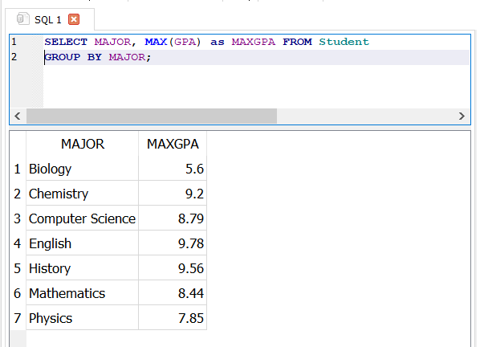
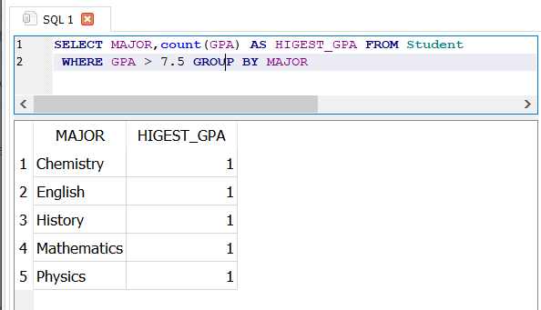

# Practice

## Create the database

```sql
CREATE DATABASE IF NOT EXISTS university;
```

## Use the database

```sql
USE university;
```

## Create the Student table

```sql
CREATE TABLE IF NOT EXISTS Student (
        STUDENT_ID INT PRIMARY KEY,
        FIRST_NAME VARCHAR(50),
        LAST_NAME VARCHAR(50),
        GPA DECIMAL(4,2),
        ENROLLMENT_DATE DATETIME,
        MAJOR VARCHAR(50)
    );
```

## Insert records into the Student table

```sql
   INSERT INTO Student (STUDENT_ID, FIRST_NAME, LAST_NAME, GPA, ENROLLMENT_DATE, MAJOR) VALUES
    (201, 'Shivansh', 'Mahajan', 8.79, '2021-09-01 09:30:00', 'Computer Science'),
    (202, 'Umesh', 'Sharma', 8.44, '2021-09-01 08:30:00', 'Mathematics'),
    (203, 'Rakesh', 'Kumar', 5.60, '2021-09-01 10:00:00', 'Biology'),
    (204, 'Radha', 'Sharma', 9.20, '2021-09-01 12:45:00', 'Chemistry'),
    (205, 'Kush', 'Kumar', 7.85, '2021-09-01 08:30:00', 'Physics'),
    (206, 'Prem', 'Chopra', 9.56, '2021-09-01 09:24:00', 'History'),
    (207, 'Pankaj', 'Vats', 9.78, '2021-09-01 02:30:00', 'English'),
    (208, 'Navleen', 'Kaur', 7.00, '2021-09-01 06:30:00', 'Mathematics');
```

  

## Create the Program table

```sql
    CREATE TABLE IF NOT EXISTS Program (
        STUDENT_REF_ID INT,
        PROGRAM_NAME VARCHAR(50),
        PROGRAM_START_DATE DATETIME,
        FOREIGN KEY (STUDENT_REF_ID) REFERENCES Student(STUDENT_ID)
    );
```

## Insert records into the Program table

```sql
    INSERT INTO Program (STUDENT_REF_ID, PROGRAM_NAME, PROGRAM_START_DATE) VALUES
    (201, 'Computer Science', '2021-09-01 00:00:00'),
    (202, 'Mathematics', '2021-09-01 00:00:00'),
    (208, 'Mathematics', '2021-09-01 00:00:00'),
    (205, 'Physics', '2021-09-01 00:00:00'),
    (204, 'Chemistry', '2021-09-01 00:00:00'),
    (207, 'Psychology', '2021-09-01 00:00:00'),
    (206, 'History', '2021-09-01 00:00:00'),
    (203, 'Biology', '2021-09-01 00:00:00');
```


## Create the Scholarship table

```sql
    CREATE TABLE IF NOT EXISTS Scholarship (
        STUDENT_REF_ID INT,
        SCHOLARSHIP_AMOUNT INT,
        SCHOLARSHIP_DATE DATETIME,
        FOREIGN KEY (STUDENT_REF_ID) REFERENCES Student(STUDENT_ID)
    );
```

## Insert records into the Scholarship table

```sql
    INSERT INTO Scholarship (STUDENT_REF_ID, SCHOLARSHIP_AMOUNT, SCHOLARSHIP_DATE) VALUES
    (201, 5000, '2021-10-15 00:00:00'),
    (202, 4500, '2022-08-18 00:00:00'),
    (203, 3000, '2022-01-25 00:00:00'),
    (201, 4000, '2021-10-15 00:00:00');
```



## GFG Questions

1. ***Write a SQL query to fetch “FIRST_NAME” from the Student table in upper case and use ALIAS name as STUDENT_NAME.***
  
    ```sql
        SELECT upper(FIRST_NAME) as STUDENT_NAME FROM Student
    ```

    

2. ***Write a SQL query to fetch unique values of MAJOR Subjects from Student table.***

    ```sql
        SELECT DISTINCT MAJOR FROM Student
        SELECT MAJOR FROM Student GROUP By MAJOR;
    ```

    

3. ***Write a SQL query to print the first 3 characters of FIRST_NAME from Student table.***

     ```sql
        SELECT substr(FIRST_NAME,1,3) FROM Student;
        SELECT SUBSTRING(FIRST_NAME, 1, 3)  FROM Student;
    ```

    

4. ***Write a SQL query to find the position of alphabet (‘a’) int the first name column ‘Shivansh’ from Student table.***

    ```sql
        SELECT INSTR(FIRST_NAME, 'a') FROM Student Where FIRST_NAME= "Shivansh"
    ```

    

5. ***Write a SQL query that fetches the unique values of MAJOR Subjects from Student table and print its length.***

    ```sql
        SELECT MAJOR,length(MAJOR) FROM Student GROUP By MAJOR;
        SELECT DISTINCT MAJOR, LENGTH(MAJOR) FROM Student;
    ```

    

6. ***Write a SQL query to print FIRST_NAME from the Student table after replacing ‘a’ with ‘A’***

    ```sql
        SELECT replace(FIRST_NAME,'a','A') FROM Student;
    ```

    

7. ***Write a SQL query to print the FIRST_NAME and LAST_NAME from Student table into single column COMPLETE_NAME.***

    ```sql
    SELECT FIRST_NAME || ' ' || LAST_NAME AS COMPLETE_NAME FROM Student;

    ```

    

8. ***Write a SQL query to print all Student details from Student table order by FIRST_NAME Ascending and MAJOR Subject descending.***

    ```sql
    SELECT * FROM Student ORDER By FIRST_NAME, MAJOR DESC ;

    ```

    

9. ***Write a SQL query to print details of the Students with the FIRST_NAME as ‘Prem’ and ‘Shivansh’ from Student table***

    ```sql
        SELECT * FROM Student WHERE FIRST_NAME IN( 'Prem' ,"Shivansh");
        SELECT * FROM Student WHERE FIRST_NAME = 'Prem' or FIRST_NAME = "Shivansh";
    ```

    

10. ***Write a SQL query to print details of the Students excluding FIRST_NAME as ‘Prem’ and ‘Shivansh’ from Student table.***

    ```sql
    SELECT * FROM Student WHERE FIRST_NAME != 'Prem' or FIRST_NAME != "Shivansh";
    SELECT * FROM Student WHERE FIRST_NAME NOT IN ("Prem","Shivansh");
    ```

    

11. ***Write a SQL query to print details of the Students whose FIRST_NAME ends with ‘a’.***

    ```sql
    SELECT * FROM Student WHERE FIRST_NAME LIKE "%a";
    ```

    

12. ***Write an SQL query to print details of the Students whose FIRST_NAME ends with ‘a’ and contains six alphabets.***

    ```sql
    SELECT * FROM Student WHERE FIRST_NAME LIKE "%_____a";
    ```

13. ***Write an SQL query to print details of the Students whose GPA lies between 9.00 and 9.99.***

    ```sql
    SELECT * FROM Student WHERE GPA BETWEEN 9.00 AND 9.99;
    ```

    

14. ***Write an SQL query to fetch the count of Students having Major Subject ‘Computer Science’.***

    ```sql
    SELECT MAJOR,COUNT(MAJOR) as TOTAL FROM Student WHERE MAJOR ="Computer Science";
    ```

    

15. ***Write an SQL query to fetch Students full names with GPA >= 8.5 and <= 9.5.***

    ```sql
    SELECT FIRST_NAME || ' ' || LAST_NAME AS FULL_NAME FROM Student WHERE GPA >= 8.5 AND GPA<= 9.5;
    ```

    

16. ***Write an SQL query to fetch the no. of Students for each MAJOR subject in the descending order.***

    ```sql
    SELECT MAJOR, count(MAJOR) as TOTAL  FROM Student GROUP BY  MAJOR ORDER BY TOTAL DESC;
    ```

    

17. ***Display the details of students who have received scholarships, including their names, scholarship amounts, and scholarship dates.***

    ```sql
    SELECT st.FIRST_NAME,st.LAST_NAME ,sc.SCHOLARSHIP_AMOUNT,sc.SCHOLARSHIP_DATE
    FROM Student st JOIN Scholarship sc
    ON  st.STUDENT_ID = sc.STUDENT_REF_ID;
    ```

    

18. ***Write an SQL query to show only odd rows from Student table.***

    ```sql
    SELECT * FROM Student where STUDENT_ID%2=1;
    SELECT * FROM Student where STUDENT_ID%2!=0;
    ```

    

19. ***Write an SQL query to show only even rows from Student table.***

    ```sql
     SELECT * FROM Student where STUDENT_ID%2=0;
    ```

    

20. ***List all students and their scholarship amounts if they have received any. If a student has not received a scholarship, display NULL for the scholarship details.***

    ```sql
    SELECT st.FIRST_NAME,st.LAST_NAME ,sc.SCHOLARSHIP_AMOUNT,sc.SCHOLARSHIP_DATE
    FROM Student st LEFT JOIN Scholarship sc
    ON  st.STUDENT_ID = sc.STUDENT_REF_ID

    SELECT
        Student.FIRST_NAME,
        Student.LAST_NAME,
        COALESCE(Scholarship.SCHOLARSHIP_AMOUNT, NULL) AS SCHOLARSHIP_AMOUNT,
        COALESCE(Scholarship.SCHOLARSHIP_DATE, NULL) AS SCHOLARSHIP_DATE
    FROM
        Student
    LEFT JOIN
        Scholarship ON Student.STUDENT_ID = Scholarship.STUDENT_REF_ID;
    ```

    

21. ***Write an SQL query to show the top n (say 5) records of Student table order by descending GPA.***

    ```sql
    SELECT * FROM Student ORDER by GPA DESC limit 5
    ```

    

22. ***Write an SQL query to determine the nth (say n=5) highest GPA from a table.***

    ```sql
    SELECT * FROM Student ORDER by GPA DESC limit 4,1
    ```

    

23. ***Write an SQL query to determine the 5th highest GPA without using LIMIT keyword.***

    ```sql
    SELECT DISTINCT s1.GPA,s1.FIRST_NAME
    FROM Student s1
    WHERE 5 = (
        SELECT COUNT(DISTINCT s2.GPA)
        FROM Student s2
        WHERE s2.GPA >= s1.GPA
    )

    SELECT DISTINCT *
    FROM (
        SELECT FIRST_NAME,GPA, ROW_NUMBER() OVER (ORDER BY GPA DESC) AS row_num
        FROM Student
    ) AS ranked_gpas
    WHERE row_num = 5;
    ```

    

24. Write an SQL query to fetch the list of Students with the same GPA.

    ```sql
    SELECT * FROM Student s1, student s2
    where s1.GPA = s2.GPA and s1.STUDENT_ID!= s2.STUDENT_ID

    SELECT *FROM Student GROUP BY GPA  HAVING count(*) >1  # not working SELECT s1.STUDENT_ID, s1.FIRST_NAME, s1.GPA
    FROM Student s1
    INNER JOIN Student s2 ON s1.GPA = s2.GPA
    WHERE s1.STUDENT_ID <> s2.STUDENT_ID
    ORDER BY s1.GPA;
    ```

    

25. Write an SQL query to show the second highest GPA from a Student table using sub-query.

    ```sql
    SELECT MAX(GPA) FROM Student WHERE GPA NOT IN (SELECT MAX(GPA) FROM Student)
    SELECT *
    FROM (
        SELECT*, DENSE_RANK() OVER (ORDER BY GPA DESC) AS gpa_rank
        FROM Student
    ) AS Rankedgpa
    WHERE gpa_rank = 2;
    SELECT * FROM Student ORDER BY GPA DESC LIMIT 1,1
    ```

    

26. Write an SQL query to show one row twice in results from a table.

    ```sql
    SELECT *FROM Student
    UNION ALL
    SELECT* FROM Student ORDER BY STUDENT_ID;
    ```

    

27. Write an SQL query to list STUDENT_ID who does not get Scholarship.

    ```sql
    SELECT * FROM Student WHERE STUDENT_ID NOT IN
    (SELECT STUDENT_REF_ID FROM Scholarship)
    ```

    

28. Write an SQL query to fetch the first 50% records from a table.

    ```sql

    SELECT *
    FROM (
        SELECT*, PERCENT_RANK() OVER (ORDER BY FIRST_NAME) AS pct_rank
        FROM Student
    ) AS RankedRecords
    WHERE pct_rank <= 0.5;
    ```

    

30. Write an SQL query to show all MAJOR subject along with the number of people in there.

    ```sql
    SELECT MAJOR, count(MAJOR) as total  FROM Student group by MAJOR ORDER by total DESC
    ```

    

31. Write an SQL query to show the last record from a table.

    ```sql
    SELECT * FROM Student WHERE STUDENT_ID = (select max(STUDENT_ID) from student )
    ```

    

32. Write an SQL query to fetch the first row of a table.

    ```sql
    SELECT *,min(student_id) FROM Student  
    SELECT * FROM Student limit 1
    SELECT * FROM Student WHERE STUDENT_ID = (SELECT MIN(STUDENT_ID) FROM Student);
    ```

    

33. Write an SQL query to fetch the last five records from a table.

    ```sql
    SELECT * FROM Student ORDER BY STUDENT_ID DESC limit 5
    SELECT *
    FROM (
        SELECT*
        FROM Student
        ORDER BY STUDENT_ID DESC
        LIMIT 5
    ) AS subquery
    ORDER BY STUDENT_ID;
    ```

    

34. Write an SQL query to fetch three max GPA from a table using co-related subquery.

    ```sql
    SELECT * FROM Student WHERE GPA IN (SELECT GPA FROM Student ORDER by GPA DESC LIMIT 3)
    SELECT DISTINCT GPA FROM Student S1
    WHERE 3 >= (SELECT COUNT(DISTINCT GPA) FROM Student S2 WHERE S1.GPA <= S2.GPA)
    ORDER BY S1.GPA DESC;
    ```

    

35. Write an SQL query to fetch three min GPA from a table using co-related subquery.

    ```sql
    SELECT DISTINCT GPA FROM Student S1
    WHERE 3 >= (SELECT COUNT(DISTINCT GPA) FROM Student S2 WHERE S1.GPA >= S2.GPA)
    ORDER BY S1.GPA;
    ```

    

36. Write an SQL query to fetch nth max GPA from a table.

    ```sql
    SELECT GPA FROM Student group by gpa order by gpa DESC limit 5;
    
    SELECT DISTINCT GPA FROM Student S1
    WHERE n >= (SELECT COUNT(DISTINCT GPA) FROM Student S2 WHERE S1.GPA <= S2.GPA) ORDER BY S1.GPA DESC;
    ```

    

37. Write an SQL query to fetch MAJOR subjects along with the max GPA in each of these MAJOR subjects.

    ```sql
    SELECT MAJOR, GPA FROM Student GROUP BY GPA;
    
    SELECT MAJOR, MAX(GPA) as MAXGPA FROM Student GROUP BY MAJOR;
    ```

    

38. Write an SQL query to fetch the names of Students who has highest GPA.

    ```sql
    SELECT FIRST_NAME, MAX(GPA) FROM Student GROUP BY GPA; (not working)
    
    SELECT FIRST_NAME,GPA FROM Student WHERE GPA =(SELECT MAX(GPA) FROM Student)
    ```

    

39. Write an SQL query to show the current date and time.

    ```sql
    SELECT CURRENT_TIMESTAMP AS CurrentDateTime;
    
    SELECT CURRENT_DATE AS CurrentDateTime;
    ```

    

40. Write a query to create a new table which consists of data and structure copied from the other table (say Student) or clone the table named Student.

    ```sql
    CREATE TABLE clone AS SELECT * FROM Student
    ```

    

41. Write an SQL query to update the GPA of all the students in ‘Computer Science’ MAJOR subject to 7.5.

    ```sql
    UPDATE Student SET GPA = 7.5 WHERE MAJOR = "Computer Science"
    ```

    

42. Write an SQL query to find the average GPA for each major.

    ```sql
    SELECT MAJOR,avg(GPA) FROM Student GROUP BY MAJOR
    ```

    

43. Write an SQL query to show the top 3 students with the highest GPA.

    ```sql
         SELECT * FROM Student ORDER BY GPA DESC LIMIT 3;
    ```

44. Write an SQL query to find the number of students in each major who have a GPA greater than 7.5.

    ```sql
    SELECT MAJOR,count(GPA) AS HIGEST_GPA FROM Student WHERE GPA > 7.5 GROUP BY MAJOR
    ```

    ;

45. Write an SQL query to find the students who have the same GPA as ‘Shivansh Mahajan’.

    ```sql
    SELECT s1.FIRST_NAME ||' '|| s1.LAST_NAME as full_name, s2.GPA FROM Student s1
    join Student s2 ON s1.STUDENT_ID = s2.STUDENT_ID
    WHERE s1.FIRST_NAME = "Shivansh" and s1. LAST_NAME ="Mahajan"
    and s1.GPA = s2.GPA

    SELECT * FROM Student WHERE GPA = (SELECT GPA FROM Student WHERE FIRST_NAME = 'Shivansh'
    AND LAST_NAME = 'Mahajan');
    ```

    
