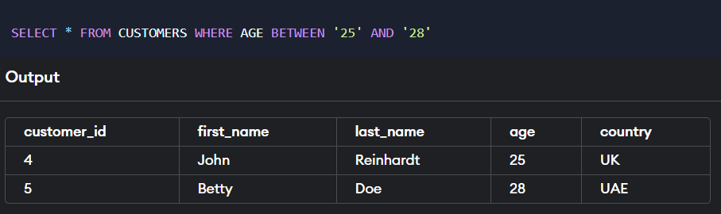
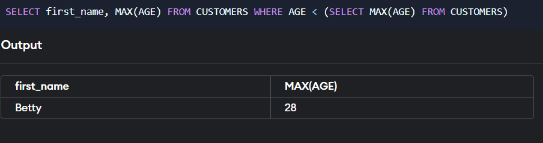
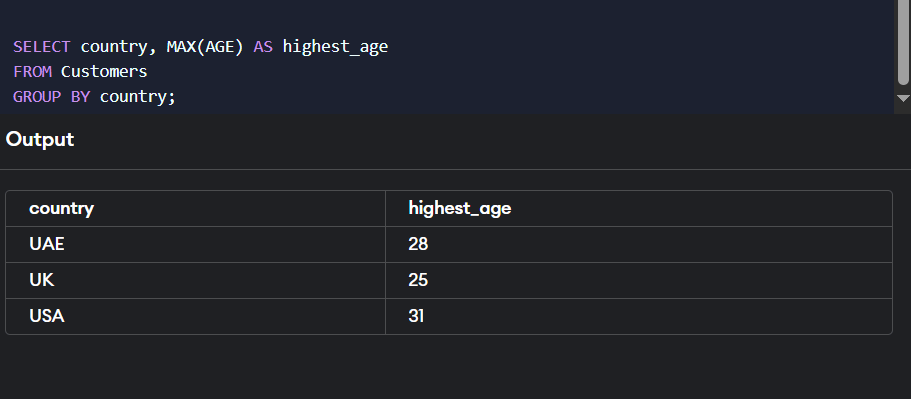
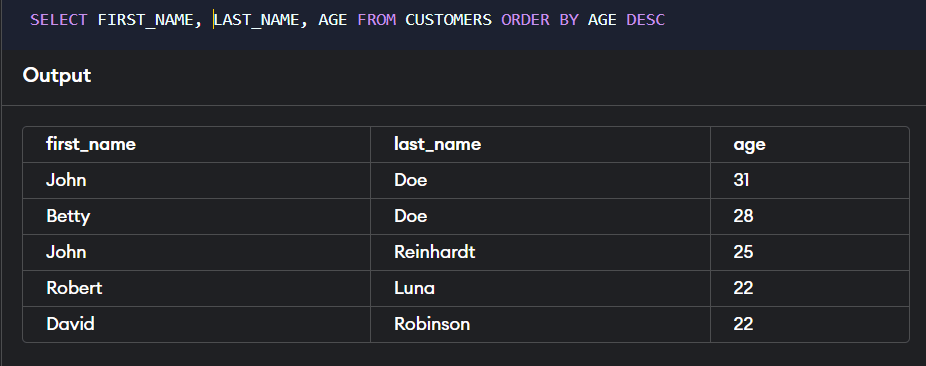
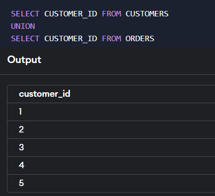
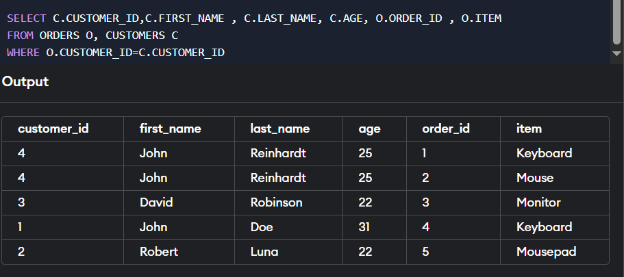
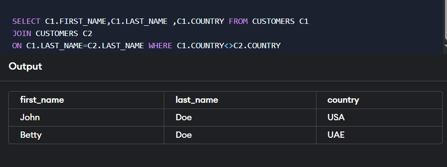
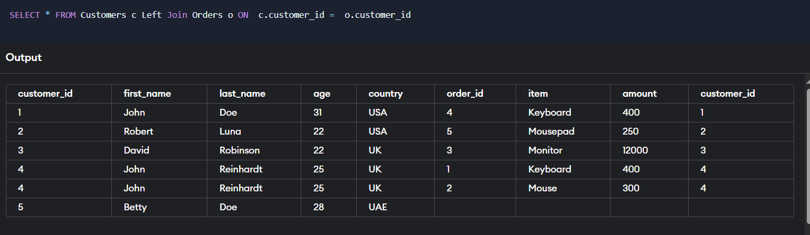

# Practice queries

<https://www.programiz.com/sql/online-compiler/>


## Q 1: FIND TOTAL COUNT OF CUSTOMER ID IN TABLE CUSTOMER?

ANS: `SELECT COUNT (CUSTOMER_id) AS TOTAL_COUNT FROM CUSTOMERS`


## QUE 2:FIND TOTAL Customers WHERE AGE IS GREATOR THAN 23?

```sql
SELECT COUNT (CUSTOMER_id) AS TOTAL_COUNT FROM CUSTOMERS WHERE AGE > '23'
```


## Q3: COUNT LIST OF RECORD WHERE COUNTRY nane IS USA?

```sql
SELECT COUNT (COUNTRY) AS TOTAL_RECORD FROM CUSTOMERS WHERE 
COUNTRY='USA'
```


## Q4: COUNT LIST OF RECORD WHERE FIRST NAME STARTS WITH J?

```sql
SELECT COUNT (FIRST_NAME) AS NAMES FROM CUSTOMERS WHERE FIRST_NAME LIKE 'J%'
```


## Q5: FETCH COUNT NUMBER RECORD OF CUSTOMERS WHERE AGE LIMIT BETWEEN 20 TO 28?

```sql
SELECT COUNT (customer_id) FROM CUSTOMERS WHERE AGE BETWEEN '25' AND '28'
```



## Q5: FETCH COUNT NUMBER RECORD OF CUSTOMERS WHERE  not AGE LIMIT BETWEEN 20 TO 28?


## Q6: FIND HIHGEST AGE IN CUSTOMER?

```sql
SELECT MAX (AGE) AS HIGH_AGE FROM CUSTOMERS
```


## Q7: FIND MIN AGE IN CUSTOMER?

```sql
SELECT MIN (AGE) AS LOW_AGE FROM CUSTOMERS
```


## Q8: FIND SECOND HIGHEST AGE IN CUSTOMER?

```sql
SELECT * FROM CUSTOMERS ORDER BY AGE DESC LIMIT 1,1
```

***NOTE : IT WILL SKIP THE FIRST VALUE AND SHOW SECOND VALUE LIKE ..AFTER SORTING***

***SECOND WAY:***

```sql
SELECT MAX(A.AGE) FROM CUSTOMERS A, CUSTOMERS S
WHERE A.AGE<S.AGE`
```

***BEST WAY:***

```sql
SELECT MAX(AGE) FROM CUSTOMERS WHERE AGE < (SELECT MAX(AGE) FROM CUSTOMERS)`
```



## Q9: Display customer details WHO CUSTOMERID IS 4 AND SHOW THE DETAILS FOR ALL THE CUSTOMERS WHO LIVES IN SAME COUNTRY?

```sql
SELECT * FROM CUSTOMERS WHERE COUNTRY=(SELECT COUNTRY FROM CUSTOMERS WHERE CUSTOMER_ID = '4')```
***BEST WAY :***
```sql
SELECT T2.* FROM Customers T1, customerS T2
WHERE T1.CUSTOMER_id = '4' AND T1.cOUNTRY = T2.cOUNTRY;
```


## Q10: Country wise highest AGE , LOWEST AGE?

```sql
SELECT MAX(AGE) FROM CUSTOMERS ORDER BY FIRST_NAME
SELECT MIN(AGE) FROM CUSTOMERS ORDER BY CUSTOMER_iD

SELECT country, MIN(AGE) AS lowest_age
FROM Customers
GROUP BY country;
```



---


## Q11: Counts No of CUSTOMERS in each COUNTRY or counts no of ITEMS in Each OrderID

```sql
SELECT country, COUNT(country) AS no_of_customer FROM customers GROUP BY  country
```


## Q12: Display Alternate Records(1,3,5 or 2,4,6) ?

```sql
SELECT * FROM CUSTOMERS WHERE CUSTOMER_ID%2=1 (FOR ODD)

SELECT * FROM CUSTOMERS WHERE CUSTOMER_ID%2!=1 (FOR EVEN)

```

Note:  The modulo operation on CUSTOMER_ID will not guarantee alternating records in the sequence of rows returned.
  
- Alternate records without usinf customerID

```sql
        WITH NumberedRows AS (
            SELECT *, ROW_NUMBER() OVER (ORDER BY (SELECT NULL)) AS RowNum
            FROM Customers
            )
            SELECT *
            FROM NumberedRows
            WHERE RowNum % 2 = 1;
```


## Q13: SHOW FIRST_NAME AND LAST_NAME AND AGE BY DESC ORDER OF AGE

```sql
SELECT FIRST_NAME,LAST_NAME ,AGE FROM CUSTOMERS ORDER BY AGE DESC
```



## Q14 : Display Duplicate name of a Column

- (GROUP BY USING ALL DUPLICATE VALUES HAS BEEN REMOVED AND WE NEED TO SEARCH MORE ON IT)
- Select first_name from customers group by first_name

- Display Duplicate of a Column (NEED TO SEARCH MORE HAVING BY & GROUP BY)
  - `Select first_name,COUNT(*) from customers GROUP BY FIRST_NAME HAVING COUNT(*)>1;`

- OR (IF WE WANT TO PRINT THE FULL RECORD)

```sql
        SELECT *
        FROM CUSTOMERS
        WHERE FIRST_NAME IN (
            SELECT FIRST_NAME
            FROM CUSTOMERS
            GROUP BY FIRST_NAME
            HAVING COUNT(*) > 1
        );


        SELECT *
        FROM your_table
        WHERE column_name IN (
            SELECT column_name
            FROM your_table
            GROUP BY column_name
            HAVING COUNT(*) > 1
        );
```


## Q15: Select first 4 row from tabel

```sql
SELECT * FROM CUSTOMERS LIMIT 4
```


## Q16: JOINS TWO TABLE AND SHOW ALL COULUMS FOR BOTH THE TABLES AND PRINT LAST THREE LESSER AMOUNT

```sql

    SELECT * FROM CUSTOMERS
    JOIN ORDERS ON CUSTOMERS.CUSTOMER_ID = ORDERS.CUSTOMER_ID
     ORDER BY AMOUNT LIMIT 3;
```

NOTE : WE HAVE USE FULL JOIN HERE AND PRINT THE LOWEST THREE VALUES OF AMOUNT


## Q17: Print FIRST_NAME , LAST_NAME AND AMOUNT WHO BROUGHT KEYBOARD

```sql
    SELECT FIRST_NAME, LAST_NAME, AMOUNT
        FROM CUSTOMERS
        JOIN ORDERS ON CUSTOMERS.CUSTOMER_ID=ORDERS.CUSTOMER_ID
        WHERE ITEM LIKE '%KEYBOARD%
```

 

## Q18: PRINT LIST IF ITEM , PRICE WHICH IS SELLING IN USA OR UK

```sql
    SELECT ITEM,AMOUNT
    FROM CUSTOMERS
    JOIN ORDERS
    ON CUSTOMERS.CUSTOMER_ID=ORDERS.CUSTOMER_ID
    WHERE COUNTRY IN ('USA','UAE')
```


## Q 19: PRINT LIST IF ITEM , AMOUNT,COUNTRY WHICH HAS BEEN DELIVERED

- (JOINS FOR THREE TABLES)

```sql
    SELECT ITEM,AMOUNT,COUNTRY
    FROM CUSTOMERS
    JOIN ORDERS
    ON CUSTOMERS.CUSTOMER_ID=ORDERS.CUSTOMER_ID
    JOIN SHIPPINGS ON CUSTOMERs.CUSTOMER_ID=SHIPPINGS.CUSTOMER
    WHERE STATUS = 'Delivered'
```


## Q20 :  union vs uninonall

- UNION (REMOVE DUPLICATES)
  - Purpose: Combines the results of two or more queries and removes duplicate rows from the final result set
  - Performance: May be slower compared to UNION ALL because it involves additional processing to remove duplicates.

```sql

    - SELECT CUSTOMER_ID FROM CUSTOMERS
            UNION
            SELECT CUSTOMER_ID FROM ORDERS
```



- UNION ALL (PRINT BOTH AS ITS IS)
  - Purpose: Combines the results of two or more queries without removing duplicates.
  - Performance: Generally faster than UNION because it does not perform the additional step of removing duplicates

```sql
   SELECT CUSTOMER_ID FROM CUSTOMERS
   UNION
   SELECT CUSTOMER_ID FROM ORDERS
```

## UNION ALL


## QUE 21 : INNER JOIN - ONLY SHOWS COMMON DATA

```sql
SELECT C.CUSTOMER_ID,C.FIRST_NAME , C.LAST_NAME, C.AGE, O.ORDER_ID , O.ITEM
FROM CUSTOMERS C
INNER JOIN ORDERS O ON C.CUSTOMER_ID=O.CUSTOMER_ID
```


OR

```sql
SELECT C.CUSTOMER_ID,C.FIRST_NAME , C.LAST_NAME, C.AGE, O.ORDER_ID , O.ITEM
FROM ORDERS O, CUSTOMERS C
WHERE O.CUSTOMER_ID=C.CUSTOMER_ID
```



## Q 22: How can we retrieve the names of customers who share the same last name but are from different countries?

```sql
SELECT C1.FIRST_NAME,C1.LAST_NAME ,C1.COUNTRY FROM CUSTOMERS C1
JOIN CUSTOMERS C2
ON C1.LAST_NAME=C2.LAST_NAME WHERE C1.COUNTRY<>C2.COUNTRY
```



## Q 23: How can we find all customers who share the same first name and are of the same age group (within a 7-year range)?

```sql
SELECT * FROM CUSTOMERS C
JOIN CUSTOMERS C1 ON
C.FIRST_NAME=C1.FIRST_NAME
WHERE c.customer_id < c1.customer_id
    AND ABS(c.age - c1.age) < 5;
```


## Q 24: HOW TO FIND LAST ROW

```sql
SELECT * FROM `table_name` WHERE id=(SELECT MAX(id) FROM `table_name`);
```


## QUE 25 : HOW TO FETCH DATA USING LEFT JOIN


