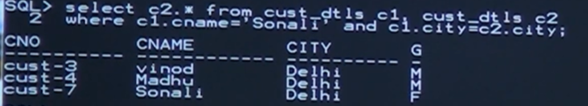

# Self join

## to run sql on jupyter notebook

### SQL Magic

- `install ipython-sql`
- `!pip install --user ipython-sql`
- Enable the SQL magic in jupyter notebook using below statement
- `%load_ext sql`

### Using SQL Magic with SQLite Database

- import sqlit3 == %load_ext sql
- conn = sqlite3.connect('HR.db') == %sql sqlite:///HR.db

```cmd
%load_ext sql
%sql sqlite:///HR.db
```

```sql
%sql SELECT name FROM sqlite_master WHERE type='table';

* sqlite:///HR.db
Done.

%%sql
CREATE TABLE students (
    id INTEGER PRIMARY KEY,
    ename TEXT NOT NULL,
    city TEXT
);
 * sqlite:///HR.db
Done.
name
students

```

```sql
%%sql
INSERT INTO students (ename, city) VALUES ('kiran', 'mub');
INSERT INTO students (ename, city) VALUES ('hari', 'hyd');
INSERT INTO students (ename, city) VALUES ('madhu', 'hyd');
INSERT INTO students (ename, city) VALUES ('smith', 'delhi');
INSERT INTO students (ename, city) VALUES ('scott', 'mub');
INSERT INTO students (ename, city) VALUES ('allen', 'hyd');
INSERT INTO students (ename, city) VALUES ('soumya', 'channi');
INSERT INTO students (ename, city) VALUES ('johai', 'delhi');
```

```sql
%%sql
SELECT * FROM students;

```

        * sqlite:///HR.db
        Done.
        id ename city
        1 kiran mub
        2 hari hyd
        3 madhu hyd
        4 smith delhi
        5 scott mub
        6 allen hyd
        7 soumya channi
        8 johai delhi

## Rename col

```sql
%%sql
ALTER TABLE students RENAME TO employee;
```

## tutorial link <https://www.youtube.com/watch?v=186TuLumGSM&list=PLd3UqWTnYXOkwqytT5E_tF-71tIyf0esb&index=15>

## SELF JOIN

- A table which is joined itselff is known as self join.
- In this case we can use alias name from single table

Here alias names are temporary

### Employee Table

| ename   | city |
| ------- | ---- |
| kiran | mub  |
| hari | hyd  |
| madhu | hyd  |
| smith | delhi  |
| scott | mub  |
| allen | hyd  |
| soumya | channi  |
| johai | delhi  |

### - Q1: Display employee details Who is living in a city where jhonne is living?

pic here

------

1. Goto first alias table and check the employee name "Jhone"
2. If it is there then get his city'
3. Then the city from first alias table is compared with all city names in 2nd alias table.
4. If the city values are equal then get the records from (records alias table)alias table

1). ANS

```sql
    WHERE e1.ename = 'johai'
        AND
    e1.city = e2.city

    SELECT e2.*
    FROM employee e1,employee e2
    WHERE e1.ename = 'Jhone'
    AND
    e1.city = e2.city
o/p -> swith delhi, johan delhi
```

```sql
%%sql
SELECT e2.ename, e2.city
FROM employee e1, employee e2
WHERE e1.ename = 'johai'
AND e1.city = e2.city;
```

ename city
johai delhi
smith delhi

### Q2. Display employee details who is working like 'smit'?

```sql
SELECT e2.* FROM emp  e1, emp  e2
WHERE e1.ename = "SMIT" AND e1.job = e2.job
```

```sql
%%sql
CREATE TABLE emp (
    empno INTEGER PRIMARY KEY,
    ename TEXT NOT NULL,
    job TEXT,
    mgr INTEGER,
    hiredate TEXT,
    sal REAL,
    comm REAL,
    deptno INTEGER
);

%%sql
INSERT INTO emp (empno, ename, job, mgr, hiredate, sal, comm, deptno) 
VALUES (7566, 'clark', 'manager', 7839, '02-apr-81', 2975, NULL, 20);
INSERT INTO emp (empno, ename, job, mgr, hiredate, sal, comm, deptno) 
VALUES (7839, 'king', 'president', NULL, '17-nov-81', 5000, NULL, 10);
INSERT INTO emp (empno, ename, job, mgr, hiredate, sal, comm, deptno) 
VALUES (7782, 'ward', 'salesman', 7698, '28-sep-81', 1250, 500, 30);
INSERT INTO emp (empno, ename, job, mgr, hiredate, sal, comm, deptno) 
VALUES (7698, 'jones', 'manager', 7839, '09-dec-81', 2975, NULL, 30);
INSERT INTO emp (empno, ename, job, mgr, hiredate, sal, comm, deptno) 
VALUES (7788, 'scott', 'analyst', 7566, '19-apr-87', 3000, NULL, 20);
INSERT INTO emp (empno, ename, job, mgr, hiredate, sal, comm, deptno) 
VALUES (7844, 'turner', 'salesman', 7698, '08-sep-81', 1500, NULL, 30);
INSERT INTO emp (empno, ename, job, mgr, hiredate, sal, comm, deptno) 
VALUES (7876, 'adams', 'clerk', 7788, '23-may-87', 1100, NULL, 20);
INSERT INTO emp (empno, ename, job, mgr, hiredate, sal, comm, deptno) 
VALUES (7900, 'ford', 'analyst', 7566, '03-dec-81', 3000, NULL, 20);
INSERT INTO emp (empno, ename, job, mgr, hiredate, sal, comm, deptno) 
VALUES (7934, 'miller', 'clerk', 7782, '23-jan-82', 1300, NULL, 10);
INSERT INTO emp (empno, ename, job, mgr, hiredate, sal, comm, deptno) 
VALUES (7902, 'blake', 'clerk', 7698, '03-apr-81', 1600, NULL, 30);
INSERT INTO emp (empno, ename, job, mgr, hiredate, sal, comm, deptno) 
VALUES (7903, 'smith', 'manager', 7698, '03-jun-81', 2450, NULL, 10);
```

```sql
%%sql
SELECT e2.* 
FROM emp  e1, emp  e2
WHERE e1.ename = "smith" AND e1.job = e2.job;
```

empno ename job mgr hiredate sal comm deptno
7566 clark manager 7839 02-apr-81 2975.0 None 20
7698 jones manager 7839 09-dec-81 2975.0 None 30
7903 smith manager 7698 03-jun-81 2450.0 None 10

### Q3. Display customer details who is the city where c5 is living?

```sql
SELECT c2.* FROM Customers c1, customer c2
WHERE c1.cid = 'c5' AND c1.city = c2.city;
```

%%sql
SELECT c2.* FROM emp c1, emp c2
WHERE c1.empno = '7900' AND c1.deptno = c2.deptno;

empno ename job mgr hiredate sal comm deptno
7566 clark manager 7839 02-apr-81 2975.0 None 20
7788 scott analyst 7566 19-apr-87 3000.0 None 20
7876 adams clerk 7788 23-may-87 1100.0 None 20
7900 ford analyst 7566 03-dec-81 3000.0 None 20

```sql
%%sql
CREATE TABLE cust_dtls (
    cno TEXT PRIMARY KEY,
    cname TEXT NOT NULL,
    city TEXT,
    gender TEXT
);


%%sql
INSERT INTO cust_dtls (cno, cname, city, gender) VALUES ('cust-1', 'Anil', 'Texas', 'M');
INSERT INTO cust_dtls (cno, cname, city, gender) VALUES ('cust-2', 'Kiran', 'Chicago', 'M');
INSERT INTO cust_dtls (cno, cname, city, gender) VALUES ('cust-3', 'Vinod', 'Delhi', 'M');
INSERT INTO cust_dtls (cno, cname, city, gender) VALUES ('cust-4', 'Madhu', 'Delhi', 'M');
INSERT INTO cust_dtls (cno, cname, city, gender) VALUES ('cust-5', 'Rocky', 'Texas', 'M');
INSERT INTO cust_dtls (cno, cname, city, gender) VALUES ('cust-6', 'Ching Fu', 'Chicago', 'M');
INSERT INTO cust_dtls (cno, cname, city, gender) VALUES ('cust-7', 'Sonali', 'Delhi', 'F');

```

```sql
%%sql
SELECT * FROM cust_dtls;
```

- sqlite:///HR.db
Done.
cno cname city gender
cust-1 Anil Texas M
cust-2 Kiran Chicago M
cust-3 Vinod Delhi M
cust-4 Madhu Delhi M
cust-5 Rocky Texas M
cust-6 Ching Fu Chicago M
cust-7 Sonali Delhi F

### select list of records where sonli is living

- 

```sql
%%sql
SELECT c2.* from cust_dtls c1, cust_dtls c2
WHERE c1.cname="Sonali" AND c1.city = c2.city;
```

cno cname city gender
cust-3 Vinod Delhi M
cust-4 Madhu Delhi M
cust-7 Sonali Delhi F

### if we try to get from first table then we get duplicate data

becouse first alias table match records is always fixed in second alias table match records will be change for each comparison

- thats why we always perfored table 2 for self
- for 2 lias name refering same physical table

## Q4. Display employee details who is working like 'clark'

```sql
SELECT e2.* FROM emp e1, emp e2
WHERE e1.ename = 'Clark'
AND
e1.job = e2.job
```

```sql
%%sql
SELECT e2.* FROM emp e1, emp e2
WHERE e1.ename = 'ford'
AND
e1.job = e2.job
```

empno ename job mgr hiredate sal comm deptno
7900 ford analyst 7566 03-dec-81 3000.0 None 20
7788 scott analyst 7566 19-apr-87 3000.0 None 20

- Alias name maintain a tempory copy of some table.
- Dont not select data from first table if you Select it will genrate dublicate data it is preferable to get data from second alias only
- A table is join itself is called `SELF JOIN`
