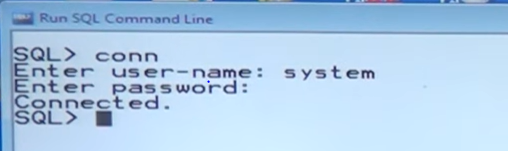
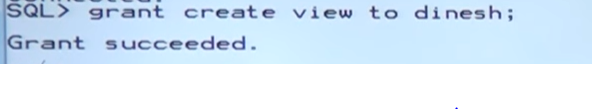
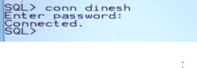
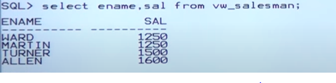
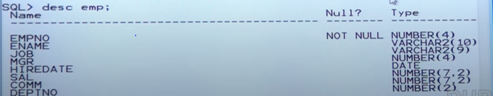
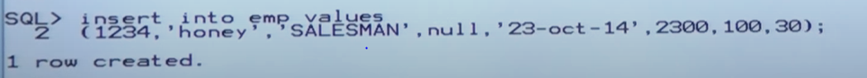
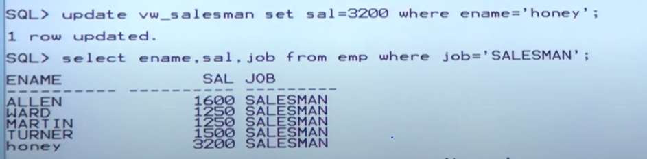
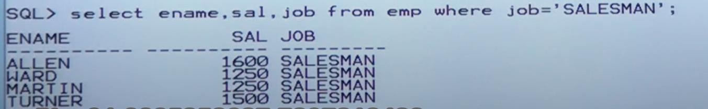
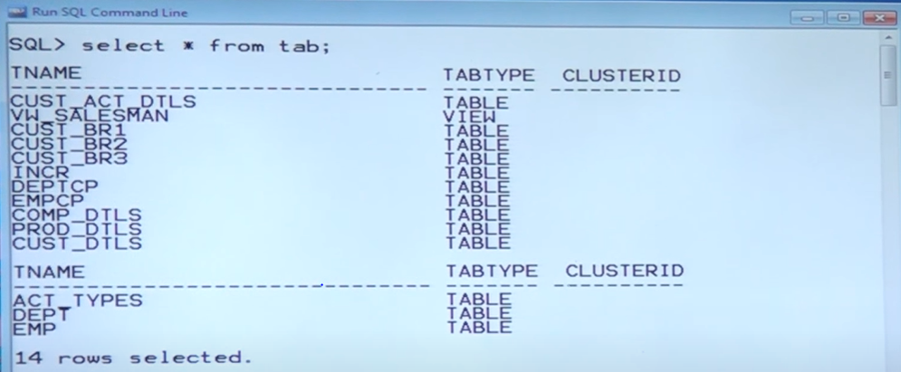

# Views

To maintain information in the form of 2-D (two dimentional) data which is nothing but table.

## Q Why we need view?

- View is just like a table
- View is not maintaing pytysical data but table is maintaing physical data.

1. View is database object
2. View contains logical copy of data

- You can create view on the table
- without table we can create a view but View is not valid that is called force view

## What is view ?

- View is DB Object

## Why View

- It contains logical copy of data from table.

## What is nessesity to maintain a view?

- Provide Security
- Increase DB performance

## Query Execution Process

Whenevery query are submitting  the querry in client tool

- client tool: SQL star plus window, any GUI tools
- GUTI Tools: SQL Developer, Pl SQL Developer for ckient tool it is intracting with oracle engine

## Oracle engine

- SQL Sstatment Execution
- PL/SQL Engine

pic digramher
anothere digram here

PL/SQL program is group of statement to perform task, some lines pf programming statement.

- SQL queries are submitted to SQL Statment executor
- Programming statements are submited to PL/SQL engine
- SQL statement executoe is a component which is compling sql queries
- PL/SQL engine is a component which is compiling pl programing satatements

- once compliation over it is communicat with oracle engine
- oracle engine is communcated with oracle DB
- From oracle db it will verfy table is there or not.
- If table existed then it will get the data from actual data and past it to the client system

- DD: Data Dictionary ( Contain metadata)
- AD: Actual DAta (Stored in the form of Data blecks)

### Meta Data

The structures of virtual object tables,squences synonyms, users,procedures packiages triggers alll these object structures mainainted under data dictionary(DD)

If we executedthe queries n thime the it will hit n times

- eg
- A group of 100 people executing the same query 100 number of times each
  - 100*100 = 10,000 times: it will hit database
- ***The number of hits to the database is incresing automatically database performance will be degraded***
- within a short period of time if number of hit or hitting the database there may be many number of hit to db engine the automatically db performanve will be degrade

### How to reduces no of hit?

...... continuie next time

### connect to db as a DBA

`conn`

### Take permision(Grant permintion)

`grant create view to dinesh;`

### connect to user

`conn dinesh`

## Simple View

### Create a view

`create view vw_salesman` 
`as` 
`select * from emp where job='SALESMAN` 
`order by sal;` 

####

- before getting permsion from dba we are unable to create view
- why beacouse we are working database as client
- client bydeafult having no permision to create view

## How to select data from  view?

insted of selecting data from table once you crate a view you can directly select data from the view

- all salesman's names and salaries
    `select ename,sal from vw_salesman;`

- Any new sales man information inserted into table that is reflected into view

## decc

`desc emp`

## Insert one record into the table

- Salesman record we are inserting into table EMP
- if he is salesman then only it will be  revelected to view onther job should not be reflected

- `insert into emp values` 
   `(1234,'honey','SALESMAN',null,'23-oct-24',2300,100,30);`

####

- `select ename,sal,job from emp where job= 'SALESMAN';`

- We didnot make the insert opration on the view
- we make the operation on table
- we are getting recored that is reflated into view also
 `select ename,sal from vw_salesman;`

## update operation on view

`update vw_salesman set sal = 3200 where ename = 'honey';`

- one row update in the view is it reflected into table ,definatly ipdated
- if we update table i.e reflated into view
- if we update view i.e reflected into table.
-

## delete record from view

if i delete a row it reflected in the table. from the tabel also it will be deleted

- this is the simple view which is also called as updateable view
- updateable view means on the view you are appling update,delete,insert command as a result table is affected
- if you did somthing in the table the respected data will be reflected into view also automatically beacuse view maintains dynamic data

## Composit view

### Q what is composite view how can i create

