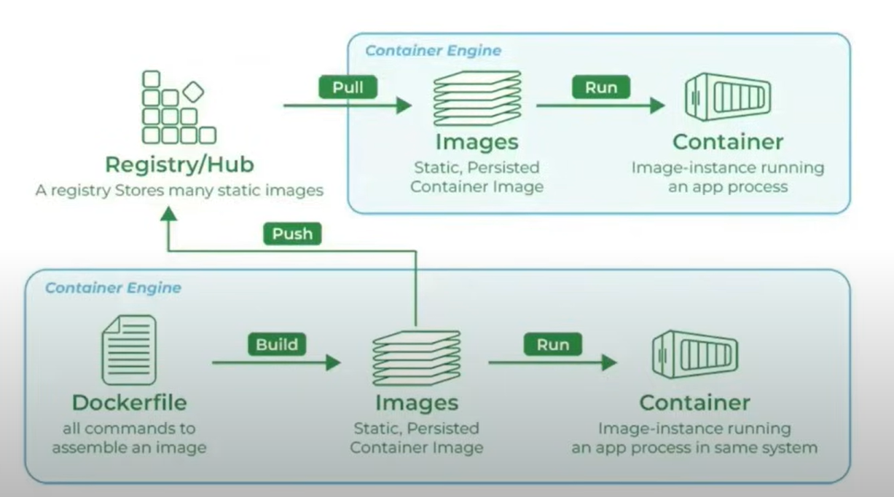

# Docker

## What is docker

Docker is a platform designed to help developers build, share and run container applications.

## Why do we need dockers?

### **Consistency Across Environments**

- **Problem:** Applications often behave differently in development, testing, and production environments due to variations in configurations, dependencies, and infrastructure.
- **Solution:** Docker containers encapsulate all the necessary components, ensuring the
application runs consistently across all environments.

### Isolation

- **Problem:** Running multiple applications on the same host can lead to conflicts, such as
dependency clashes or resource contention.
- **Solution:** Docker provides isolated environments for each application, preventing
interference and ensuring stable performance.

### Scalability

- **Problem:** Scaling applications to handle increased load can be challenging, requiring
manual intervention and configuration.
- **Solution:** Docker makes it easy to scale applications horizontally by running multiple
container instances, allowing for quick and efficient scaling.

### How exactly Docker is used?

## Docker Engine

Docker Engine is the core component of the Docker platform, responsible for creating,
running, and managing Docker containers. It serves as the runtime that powers Docker's
containerization capabilities. Here’s an in-depth look at the Docker Engine:

### Components of Docker Engine

1. Docker Daemon (dockerd):

    - **Function:** The Docker daemon is the background service running on the host
machine. It manages Docker objects such as images, containers, networks, and
volumes.

    - **Interaction:** It listens for Docker API requests and processes them, handling container
lifecycle operations (start, stop, restart, etc.).

2. Docker CLI (docker):
    - **Function:** The Docker Command Line Interface (CLI) is the tool that users interact
with to communicate with the Docker daemon.

    - **Usage:** Users run Docker commands through the CLI to perform tasks like building
images, running containers, and managing Docker resources.

3. REST API:
    - **Function:** The Docker REST API allows communication between the Docker CLI and
the Docker daemon. It also enables programmatic interaction with Docker.

    - **Usage:** Developers can use the API to automate Docker operations or integrate
Docker functionality into their applications

## Docker Image

A Docker image is a lightweight, stand-alone, and executable software package that includes
everything needed to run a piece of software, such as the code, runtime, libraries,
environment variables, and configuration files. Images are used to create Docker containers,
which are instances of these images.

### Components of a Docker Image

1. Base Image: The starting point for building an image. It could be a minimal OS image like
alpine, a full-fledged OS like ubuntu, or even another application image like python or
node.

2. Application Code: The actual code and files necessary for the application to run.
3. Dependencies: Libraries, frameworks, and packages required by the application.
4. Metadata: Information about the image, such as environment variables, labels, and
exposed ports.

### Docker Image Lifecycle

1. Creation: Images are created using the docker build command, which processes the
instructions in a Dockerfile to create the image layers.

2. Storage: Images are stored locally on the host machine. They can also be pushed to and
pulled from Docker registries like Docker Hub, AWS ECR, or Google Container Registry.

3. Distribution: Images can be shared by pushing them to a Docker registry, allowing others
to pull and use the same image.

4. Execution: Images are executed by running containers, which are instances of these
images.

## Dockerfile

A Dockerfile is a text file that contains a series of instructions used to build a Docker image.
Each instruction in a Dockerfile creates a layer in the image, allowing for efficient image
creation and reuse of layers. Dockerfiles are used to automate the image creation process,
ensuring consistency and reproducibility.

### Key Components of a Dockerfile

1. Base Image (FROM) - Specifies the starting point for the image, which could be a minimal
operating system, a specific version of a language runtime, or another image. Example:
FROM ubuntu:20.04

2. Labels (LABEL) - Adds metadata to the image, such as version, description, or maintainer.
Example: LABEL version="1.0" description="My application"

3. Run Commands (RUN) - Executes commands in the image during the build process,
typically used to install software packages. Example: RUN apt-get update && apt-get
install -y python3

4. Copy Files (COPY)- Copies files or directories from the host system to the image. Example:
COPY . /app

5. Environment Variables (ENV) - Sets environment variables in the image. Example: ENV
PATH /app/bin:$PATH

6. Work Directory (WORKDIR) - Sets the working directory for subsequent instructions.
Example: WORKDIR /app

7. Expose Ports (EXPOSE)- Informs Docker that the container listens on specified network
ports. Example: EXPOSE 8080

8. Command (CMD) - Provides a default command to run when the container starts.
Example: CMD ["python", "app.py"]

9. Volume (VOLUME) - Creates a mount point with a specified path and marks it as holding
externally mounted volumes from the host or other containers. Example: VOLUME
["/data"]

10. Arguments (ARG) - Defines build-time variables. Example: ARG VERSION=1.0

## Docker Container

A Docker container is a lightweight, portable, and isolated environment that encapsulates an
application and its dependencies, allowing it to run consistently across different computing
environments. Containers are created from Docker images, which are immutable and contain
all the necessary components for the application to run.

## Registry

A Docker registry is a service that stores and distributes Docker images. It acts as a repository
where users can push, pull, and manage Docker images. Docker Hub is the most well-known
public registry, but private registries can also be set up to securely store and manage images
within an organization.

Key Components of a Docker Registry

1. Repositories: A repository is a collection of related Docker images, typically different
versions of the same application. Each repository can hold multiple tags, representing
different versions of an image.

2. Tags: Tags are used to version images within a repository. For example, myapp:1.0,
myapp:2.0, and myapp:latest are tags for different versions of the myapp image.

### Types of Docker Registries

1. Docker Hub:
    - Description: The default public registry provided by Docker, which hosts a vast number of public images and also supports private repositories.

    - URL: hub.docker.com
    - Use Case: Publicly sharing images and accessing a large collection of pre-built images from the community and official repositories.

2. Private Registries:
    - Description: Custom registries set up by organizations to securely store and manage their own Docker images.
    - Use Case: Ensuring security and control over image distribution within an organization.

3. Third-Party Registries:
    - Examples: Amazon Elastic Container Registry (ECR), Google Container Registry (GCR), Azure Container Registry (ACR).

    - Use Case: Integrating with cloud platforms for seamless deployment and

### Benefits of Using Docker Registries

1. Centralized Image Management: Registries provide a centralized location to store and
manage Docker images, making it easier to organize and distribute them.

2. Version Control: Using tags, registries allow version control of images, enabling users to
easily roll back to previous versions if needed.

3. Collaboration: Public registries like Docker Hub facilitate collaboration by allowing users
to share images with the community or within teams.

4. Security: Private registries ensure that sensitive images are stored securely and access is
controlled within an organization.

5. Integration with CI/CD: Registries integrate seamlessly with CI/CD pipelines, automating
the process of building, storing, and deploying Docker images.

## Use-cases

### Microservices Architecture

- Description: Microservices break down applications into smaller, independent services,
each running in its own container.
- Benefits: Simplifies deployment, scaling, and maintenance. Each service can be
developed, updated, and deployed independently.

### Continuous Integration and Continuous Deployment (CI/CD)

- Description: Docker ensures a consistent environment from development through testing
to production.
- Benefits: Streamlines the CI/CD pipeline, reduces discrepancies between environments,
and speeds up testing and deployment processes.

### Cloud Migration

- Description: Containerizing applications to move them to the cloud.
- Benefits: Simplifies the migration process, allows applications to run consistently across
different cloud providers, and optimizes resource usage.

### Scalable Web Applications

- Description: Deploying web applications in containers for easy scaling.
- Benefits: Simplifies scaling up or down based on traffic, ensures consistent deployment,
and enhances resource utilization.

### Testing and QA

- Description: Creating consistent environments for testing applications.
- Benefits: Ensures tests are run in environments identical to production, speeds up the
setup of test environments, and facilitates automated testing.

### Machine Learning and AI

- Description: Deploying machine learning models and AI applications in containers.
- Benefits: Ensures consistency in the runtime environment, simplifies scaling of model
training and inference, and facilitates collaboration and reproducibility.

### API Development and Deployment

- Description: Developing and deploying APIs in containers.
- Benefits: Ensures APIs run consistently across environments, simplifies scaling, and improves deployment speed and reliability

- Description: Developing and deploying APIs in containers.
- Benefits: Ensures APIs run consistently across environments, simplifies scaling, and improves deployment speed and reliability.
