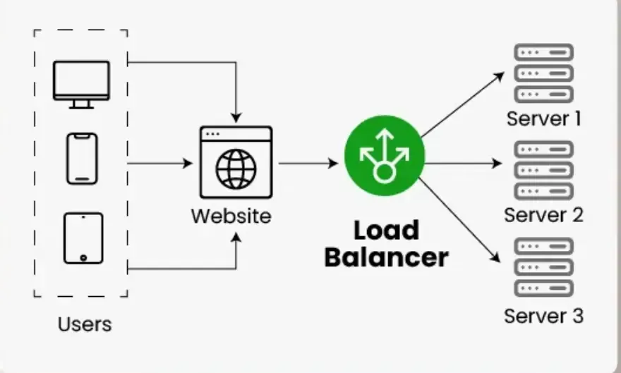
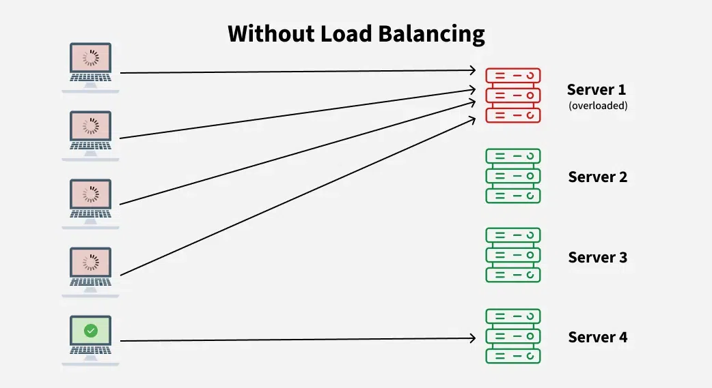
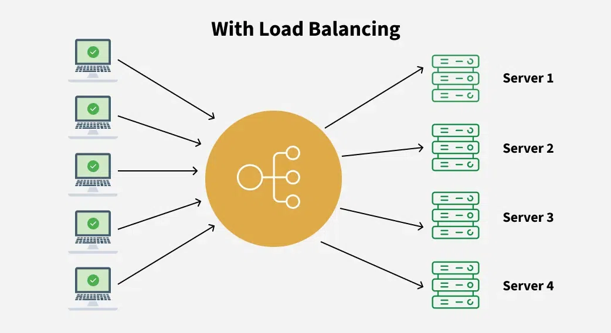
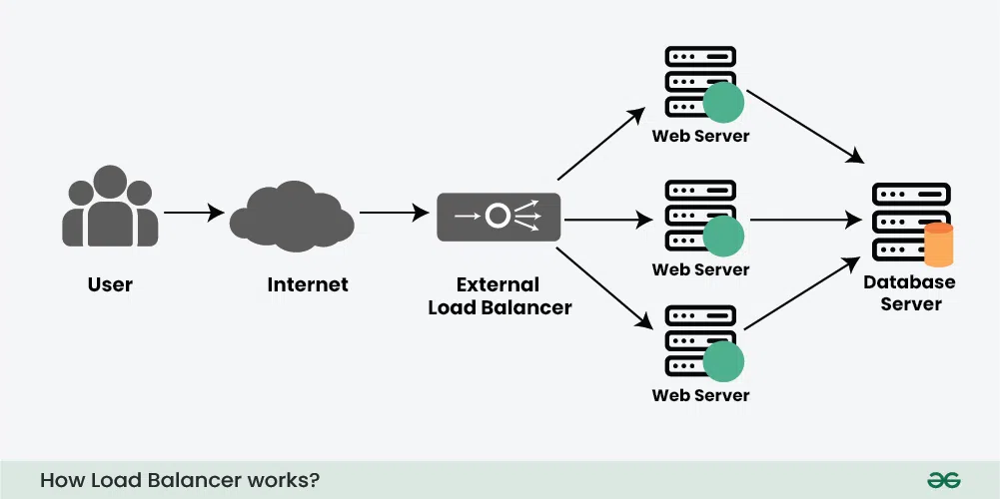
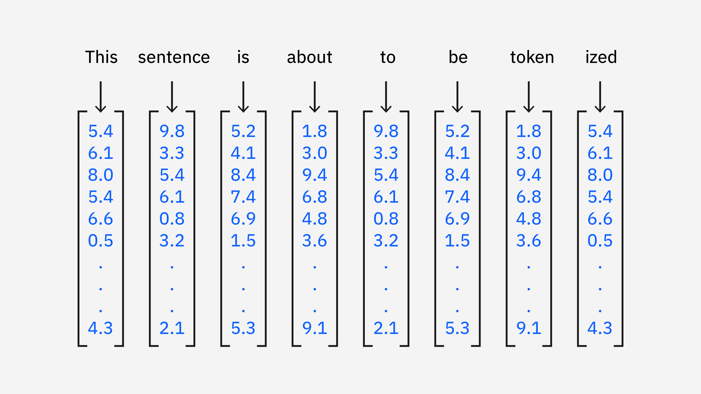

Tell me about yourself.
tips: introduce aisa kro k woh majboor ho jaye tumhe sunne k liye. energetic. use body language. face language.
do not move your head so much. stop using so much and and and.
ques: apart from general introduction. how will you introduce yourself? how should I see you?

name, place, job description, experience, project, hobbies.

Hello, my name is Ashish Bindra and you can address me Ashish. I hail from Patiala. I am a python developer with 3 years of experience. Currently I'm working on ....... project using ...... tools. In the free time I like to do gardening.

### **1. Tell me about yourself**

I am Ashish Bindra, a Python developer with around 2.10 years of experience in building AI/ML projects, REST APIs, and web applications. I have strong expertise in Python, FastAPI, and MongoDB, and I’ve also worked with YOLO-based invoice translation and OCR projects. Alongside backend development, I also ensure clean, efficient, and scalable code with a focus on performance.

---

### **2. Why do you want to switch the company? / Why do you want to join our company?**

I am looking for new opportunities where I can work on challenging projects, enhance my technical skills, and contribute to impactful solutions. I’m particularly interested in your company because of the innovative projects, collaborative culture, and the scope for professional growth.

---

### **3. What are your expectations for salary? / Is expected salary negotiable?**

I am looking for a fair package that matches my skills, experience, and industry standards. However, I am flexible and open to negotiation if there is good learning and growth opportunity.

---

### **4. What kind of frameworks and tools have you used so far?**

I have mainly worked with **FastAPI**, **Flask**, and a bit of **Django** for web and API development. For databases, I’ve used **MongoDB (NoSQL)** and **MySQL/PostgreSQL (SQL)**. I have also used **YOLO for object detection**, **OpenCV**, **Pandas**, and **NumPy** for data handling, and **PyTest** for testing.

---

### **5. How many projects have you done? Explain current project.**

I have worked on multiple projects, around 4–5 in total. Currently, I am working on an **Invoice Translation System**. The project detects fields like invoice number, description, and dates using **YOLO models** and OCR, then translates them into formats compatible with Indian accounting systems. It uses **FastAPI** for REST APIs and **MongoDB** for storing document data.

---

### **6. Have you worked on SQL and No-SQL databases? Explain.**

Yes, I have worked on both.

* **SQL (MySQL/PostgreSQL):** I used it where data is structured and relationships between tables are important, like user management and transactional records.
* **NoSQL (MongoDB):** I used it where data is document-based, flexible, and schema-less, especially for invoices and OCR results.

---

### **7. What do you mean by security, scalability, and robustness?**

* **Security:** Protecting the application and data from unauthorized access, vulnerabilities, and attacks. For example, JWT authentication, data encryption, and validation.
* **Scalability:** The ability of an application to handle an increasing load (users, data, or traffic) without performance issues.
* **Robustness:** The ability of the system to perform reliably under different conditions, including handling errors gracefully and avoiding crashes.

Q.Can you explain the role of FastAPI in your projects, particularly in the chatbot application you developed?
FastAPI plays a crucial role in my projects, especially in the chatbot application I developed. FastAPI is a modern web framework for building APIs with Python 3.7+, based on standard Python type hints. It is particularly known for its speed, ease of use, and automatic generation of OpenAPI documentation. In my chatbot project, I utilized FastAPI to create a robust backend API that served as the backbone for my application. It allowed me to handle requests efficiently and offered asynchronous capabilities, which improved the performance of my application significantly. I structured the API endpoints to facilitate various functionalities, such as fetching and updating NLU data, training models, and managing the chatbot's state. The use of FastAPI’s dependency injection system helped me to manage resources effectively, leading to clean and maintainable code. Furthermore, its automatic JSON serialization and validation features saved me a lot of time and effort, ensuring that data transmitted between the client and server was both structured and valid. In the context of the chatbot, I utilized FastAPI to combine various machine learning and NLP resources, such as Rasa, enabling the bot to understand user intents effectively. I implemented the training workflow through API calls, allowing admin users to train models directly from the dashboard with minimal friction. Additionally, deploying the chatbot project with Docker-compose further enhanced its reliability and portability, ensuring that all dependencies were encapsulated within a consistent environment. Overall, FastAPI allowed me to develop an efficient, high-performance, and scalable application that met the project requirements effectively.

# What is Load Balancer & How Load Balancing works?

A load balancer is a networking device or software application that distributes and balances the incoming traffic among the servers to provide high availability, efficient utilization of servers and high performance

* Works as a "traffic cop" routing client requests across all servers
* Ensures that no single server bears too many requests, which helps improve the performance, reliability and availability of applications.

* Highly used in cloud computing domains, data centers and large-scale web applications where traffic flow needs to be managed.

### Issues without Load Balancer?

* Single Point of Failure: If the server goes down or something happens to the server the whole application will be interrupted and it will become unavailable for the users for a certain period. It will create a bad experience for users which is unacceptable for service providers.
* Overloaded Servers: There will be a limitation on the number of requests that a web server can handle. If the business grows and the number of requests increases the server will be overloaded.
* Limited Scalability: Without a load balancer, adding more servers to share the traffic is complicated. All requests are stuck with one server and adding new servers won’t automatically solve the load issue.

Note: These are the problems that are resolved with Load Balancer.

Key characteristics of Load Balancers

* Traffic Distribution: To keep any one server from becoming overburdened, load balancers divide incoming requests evenly among several servers.
High Availability: Applications' reliability and availability are improved by load balancers, which divide traffic among several servers. The load balancer reroutes traffic to servers that are in good condition in the event that one fails.
* Scalability: By making it simple to add servers or resources to meet growing traffic demands, load balancers enable horizontal scaling.
* Optimization: Load balancers optimize resource utilization, ensuring efficient use of server capacity and preventing bottlenecks.
Health Monitoring: Load balancers often monitor the health of servers, directing traffic away from servers experiencing issues or downtime.
SSL Termination: Some load balancers can handle SSL/TLS encryption and decryption, offloading this resource-intensive task from servers.

### How Load Balancer Works?

* Receives Incoming Requests: When users try to access a website or application, their requests first go to the load balancer instead of directly to a server.
* Checks Server Health: The load balancer continuously monitors the status of all servers. It checks which servers are healthy and ready to handle requests.
* Distributes Traffic: Based on factors like server load, response time or proximity, the load balancer forwards each request to the most appropriate server. This helps avoid any server getting overloaded.
* Handles Server Failures: If a server goes down or becomes unresponsive, the load balancer automatically stops sending traffic to that server and redirects it to others that are still functioning properly.
* Optimizes Performance: By spreading traffic efficiently and using healthy servers, load balancers improve overall performance and reduce delays.

### Benefits of Load Balancer

* Better Performance - Distributes traffic across servers so no single server gets overloaded, reducing downtime and improving speed.
* Scalability - Works with auto-scaling to add more servers during high traffic a-d remove them when traffic is low.
* Failure Handling - Detects unhealthy servers and redirects traffic to healthy ones, keeping the system available.
* Prevents Bottlenecks - Handles sudden spikes in traffic smoothly by spreading requests evenly.
* Efficient Resource Use - Ensures all servers share the workload fairly.
* Session Persistence - Can maintain user sessions so apps that need continuous sessions (like shopping carts) work properly

### Challenges of Load Balancer

* Single Point of Failure - If the load balancer itself goes down, it can disrupt traffic flow unless a backup exists.
* Cost and Complexity - Good load balancing solutions can be expensive and require proper setup and management.
* Configuration Issues - Setting up correctly can be tricky, especially for complex applications.
* Extra Overhead - Adds a small delay since every request passes through the load balancer.
* SSL Management - Handling encryption (SSL termination) at the balancer can make end-to-end security more complicated.

<https://www.geeksforgeeks.org/system-design/what-is-scalability/>

## What is vector search?

Vector search is a search technique used to find similar items or data points, typically represented as vectors, in large collections
* Vectors, or embeddings, are numerical representations of words, entities, documents, images or videos.
* Vectors capture the semantic relationships between elements, enabling effective processing by machine learning models and artificial intelligence applications.

### Vector search vs. traditional search

1. In contrast to traditional search, which typically uses keyword search, vector search relies on vector similarity search techniques like k-nearest neighbor search (knn) to retrieve data points similar to a query vector based on some distance metric. Vectors capture semantic relationships and similarities between data points, enabling semantic search instead of simple keyword search.
2. To illustrate the difference between traditional keyword and vector search, let’s go through an example. Say you are looking for information on the best pizza restaurant and you search for “best pizza restaurant” in a traditional keyword search engine. The keyword search looks for pages that contain the exact words “best”, “pizza” and “restaurant” and only returns results like “Best Pizza Restaurant” or “Pizza restaurant near me”. Traditional keyword search focuses on matching the keywords rather than understanding the context or intent behind the search.

By contrast, in a semantic vector search, the search engine understands the intent behind the query. Semantic, by definition, means relating to meaning in language, that is, semantic search understands the meaning and context of a query. In this case, it would look for content that talks about top-rated or highly recommended pizza places, even if the exact words "best pizza restaurant" are not used in the content. The results are more contextually relevant and might include articles or guides that discuss high quality pizza places in various locations.

3. Traditional search methods typically represent data using discrete tokens or features, such as keywords, tags or metadata. As shown in our example above, these methods rely on exact matches to retrieve relevant results. By contrast, vector search represents data as dense vectors (a vector in which most or all of the elements are non-zero) in a continuous vector space, the mathematical space in which data is represented as vectors. Each dimension of the dense vector corresponds to a latent feature or aspect of the data, an underlying characteristic or attribute that is not directly observed but is inferred from the data through mathematical models or algorithms. These latent features capture the hidden patterns and relationships in the data, enabling more meaningful and accurate representations of items as vectors in a high-dimensional space.

Traditional search methods may struggle with scalability for large datasets or high-dimensional data due to computational and memory constraints. By contrast, vector embeddings are easier to scale to larger datasets and more complex models. Unlike sparse representations of data where most of the values are zeros across dimensions, embeddings are dense vector representations having non-zero values in most dimensions. This allows vector embeddings to store more information in a smaller, lower-dimensional space, requiring less memory.1 As a result, machine learning algorithms and models can use embeddings more efficiently with fewer compute resources.
